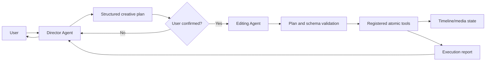

# Vistora Architecture and Responsibility Contracts

This document is the canonical description of Vistora's implemented architecture and its target responsibility boundaries. The vision chapters under `开发文档/` describe longer-term product direction; when those chapters and the current code differ, this document identifies the difference explicitly.

The keywords **MUST**, **MUST NOT**, **SHOULD**, and **MAY** define target contracts. A target contract is not evidence that the corresponding component is already implemented.

## Non-negotiable invariant

Vistora separates creative authority from mechanical execution:

1. A general-capability **Director Agent**, with specialized directing ability, owns user dialogue, requirement understanding, creative reasoning, and structured plan creation.
2. A plan MUST be explicitly confirmed by the user before execution.
3. An **Editing Agent** behaves as a constrained executor. It validates a confirmed plan and dispatches its steps without inventing new creative intent.
4. Only registered **atomic tools** may mutate timeline state or media files.



The Director may inspect read-only context and tool schemas. It MUST NOT call mutating tools, write timeline state, or render media. The Editing Agent MUST reject unconfirmed, malformed, unknown, or out-of-scope operations. It MUST NOT reinterpret the creative brief.

## Repository structure today

```text
src/
  main.py                    CLI entry point and hard-coded skill registry
  agent/
    llm_client.py            OpenAI-compatible model client
    operator_agent.py        Current hybrid conversational/tool-calling agent
  core/
    timeline.py              Timeline models and MoviePy/FFmpeg renderer
    timeline_manager.py      Persistence for the active timeline
  skills/
    base.py                  Pydantic validation and schema-export contract
    video_*.py               Registered atomic editing tools
  utils/
    hardware.py              Encoder and color metadata helpers
    proxy.py                 Reverse-proxy media generation
tests/
  run_validation.py          Synthetic end-to-end timeline/render validation
  test_architecture_boundaries.py
                              Static agent-boundary and registry checks
```

There is no frontend application, browser UI, desktop GUI, API server, or UI state store in the repository. The only user interface is the command line.

## Implemented runtime

### CLI entry points

`src/main.py` exposes four commands:

| Command | Implemented behavior | Architectural status |
| --- | --- | --- |
| `list-skills` | Prints JSON schemas for the registered skills. | Compatible with both current and target designs. |
| `run-skill` | Parses JSON and executes one named registered skill. | Low-level/manual tool interface; bypasses Director confirmation by design. |
| `render` | Loads `TimelineConfig` and invokes `TimelineRenderer` directly. | Current compatibility path; it bypasses the target atomic-tool-only mutation boundary. |
| `chat` | Creates `OperatorAgent` with the registry and enters a conversational loop. | Prototype flow; not the target Director/Editing split. |

The registry is currently a module-level dictionary named `SKILLS`. It contains:

- `VideoAddClipSkill`
- `VideoModifyClipSkill`
- `VideoExportSkill`
- `VideoTimelapseSkill`
- `VideoClearTimelineSkill`

Registration is hard-coded. There is no plugin discovery, registry version, capability negotiation, or authorization layer.

### Current conversational flow

`OperatorAgent` currently performs several roles in one class:

1. It owns the chat history and user conversation.
2. It extracts video paths and reads duration metadata.
3. It gives the LLM every registered skill schema.
4. It asks the LLM to plan tool calls.
5. It immediately parses and executes those calls, up to ten iterations.
6. It returns tool results to the LLM and finally to the user.

This flow validates individual tool arguments through `BaseSkill.execute`, but it has no separate Director Agent, structured creative-plan model, plan identifier, confirmation state, confirmation gate, or constrained Editing Agent. Therefore `OperatorAgent` MUST be treated as a legacy prototype/hybrid, not as proof that the target agent contracts are implemented.

`LLMClient` is an OpenAI-compatible transport configured by `LLM_API_KEY`, `LLM_BASE_URL`, and `LLM_MODEL`. It is not a Director or Editing Agent by itself.

### Timeline state and rendering

`src/core/timeline.py` defines three Pydantic models:

- `ClipConfig`: source, trim, timeline placement, audio, speed, reverse, and rotation properties.
- `TrackConfig`: a named ordered list of clips.
- `TimelineConfig`: output dimensions, frame rate, and a mapping of tracks.

`TimelineManager` persists one active timeline at `.workspace/current_timeline.json`. It creates default video and audio tracks, loads and validates existing JSON, saves the full model, and deletes the file when reset. It has no project identifier, transaction boundary, concurrency control, revision check, history, or rollback.

`TimelineRenderer` consumes a `TimelineConfig` and writes media. It selects single-clip and multi-clip FFmpeg fast paths where possible and falls back to a MoviePy composite path. Hardware/color/proxy helpers live under `src/utils/`.

### Atomic skill contract today

Every registered skill subclasses `BaseSkill`, declares a Pydantic `input_model`, exports an OpenAI-compatible JSON schema through `get_schema`, and receives validated parameters through `execute`.

The implemented mutation ownership is:

| Skill | Timeline mutation | Media mutation |
| --- | --- | --- |
| `VideoAddClipSkill` | Appends a clip and saves the timeline. | May create a reverse proxy. |
| `VideoModifyClipSkill` | Updates a clip and saves the timeline. | May create a reverse proxy. |
| `VideoClearTimelineSkill` | Deletes the active timeline state. | None. |
| `VideoExportSkill` | May reset timeline state after export. | Renders the timeline to an output file. |
| `VideoTimelapseSkill` | None. | Writes a new timelapse file through FFmpeg. |

These are the only registered atomic mutation entry points. Tests may reset state directly as test-fixture setup. The CLI `render` command remains a documented nonconforming compatibility exception.

Tool result dictionaries and exceptions are not yet governed by one versioned result/error schema. Atomicity currently means a bounded operation exposed as one skill; it does not yet guarantee transactional rollback, idempotency, or crash recovery.

### Validation today

`tests/run_validation.py` creates a synthetic source clip, adds and modifies timeline clips through skills, verifies persisted state, exports a video, and verifies that the output exists. It exercises the timeline, proxy, and renderer paths but is a script rather than a comprehensive test suite.

`tests/test_architecture_boundaries.py` protects two current structural properties:

- agent modules do not directly import timeline state, renderers, proxy writers, hardware encoders, or `subprocess`;
- every object in the public registry is a `BaseSkill` with a unique, object-shaped JSON schema whose exported name matches its registry key.

This lightweight check does not claim that the missing Director, confirmation gate, or Editing Agent exists.

## Target contracts

### Director Agent

The Director Agent MUST:

- remain a general-capability assistant rather than a narrow command parser;
- own all user dialogue and clarify goals, audience, platform, tone, pacing, constraints, and acceptance criteria;
- inspect read-only project/media context and available tool schemas;
- produce a structured creative plan and explain material assumptions;
- revise or reject a draft in response to the user;
- record explicit user confirmation before handoff;
- receive the execution report and communicate results to the user.

The Director Agent MUST NOT execute atomic editing tools, mutate timelines, write media, or mark its own plan as user-confirmed.

### Structured creative plan

A future executable plan MUST be versioned and include at least:

```text
plan_id
schema_version
status: draft | confirmed | rejected
objective
requirements
assumptions[]
creative_direction
operations[]:
  step_id
  tool_name
  arguments
  rationale
  expected_effect
outputs[]
risks[]
confirmed_by
confirmed_at
```

Only `status: confirmed` is executable. Confirmation MUST bind to an immutable plan version or digest so later edits invalidate the confirmation. Free-form prose alone is not an executable plan.

### Editing Agent

The Editing Agent MUST:

- accept only a structured, confirmed plan;
- validate the plan version, confirmation binding, ordering, paths, outputs, and every operation against the current registry schema;
- reject unknown tools or arguments before mutation;
- dispatch operations in declared order through registered atomic tools only;
- stop according to an explicit failure policy and return a structured execution report;
- preserve the plan's creative intent without adding or silently changing operations.

The Editing Agent MUST NOT own general user dialogue, infer missing creative choices, call renderers or timeline managers directly, or bypass tool validation.

### Atomic tools

An atomic tool MUST:

- expose a stable unique name, description, versioned input schema, and declared side effects;
- validate all input before mutation;
- perform one bounded timeline or media operation;
- return a structured success or error result;
- be callable by the Editing Agent without hidden creative decisions.

Mutation-capable utilities and core objects are implementation details behind tools. They are not agent APIs.

## Current-to-target gap register

| ID | Gap | Evidence today | Required future outcome |
| --- | --- | --- | --- |
| G-01 | Director Agent absent | No Director class, prompt, plan model, or Director tests. | Add the general-capability Director without mutation authority. |
| G-02 | No structured plan or confirmation gate | Tool calls execute immediately from the LLM response. | Add a versioned plan contract and immutable user confirmation binding. |
| G-03 | Operator combines incompatible roles | `OperatorAgent` owns dialogue, planning, and execution. | Separate/retire the hybrid behind Director and Editing contracts. |
| G-04 | Editing Agent absent | No constrained plan executor exists. | Add an executor that accepts only confirmed structured plans. |
| G-05 | Registry is hard-coded and unversioned | `SKILLS` is defined in `src/main.py`. | Provide a reusable registry contract with schema/version metadata. |
| G-06 | Direct CLI render bypass | `render` instantiates `TimelineRenderer` directly. | Route mutations through an explicit atomic tool or clearly isolated maintenance interface. |
| G-07 | Timeline state lacks production safeguards | One JSON file; no revision, transaction, history, or rollback. | Add explicit project/revision and recovery semantics. |
| G-08 | Tool outputs and side effects are not standardized | Each skill returns an ad hoc dictionary or raises. | Define versioned result, error, and side-effect contracts. |
| G-09 | No frontend/UI | Repository contains only a CLI. | Design UI state around draft, confirmation, execution, and result phases. |
| G-10 | Tests do not cover target gates | Current test covers a successful editing/render path only. | Add Director/plan/confirmation/Editing tests as those components are implemented. |

This gap register is descriptive. Closing any gap is a separate implementation task and is outside the scope of this architecture-audit step.
