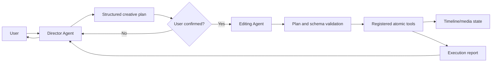

# Vistora Architecture and Responsibility Contracts

This document is the canonical description of Vistora's implemented architecture and its target responsibility boundaries. The vision chapters under `开发文档/` describe longer-term product direction; when those chapters and the current code differ, this document identifies the difference explicitly.

The keywords **MUST**, **MUST NOT**, **SHOULD**, and **MAY** define target contracts. A target contract is not evidence that the corresponding component is already implemented.

## Non-negotiable invariant

Vistora separates creative authority from mechanical execution:

1. A general-capability **Director Agent**, with specialized directing ability, owns user dialogue, requirement understanding, creative reasoning, and structured plan creation.
2. A plan MUST be explicitly confirmed by the user before execution.
3. An **Editing Agent** behaves as a constrained executor. It validates a confirmed plan and dispatches its steps without inventing new creative intent.
4. Only registered **atomic tools** may mutate timeline state or media files.



The Director may inspect read-only context and tool schemas. It MUST NOT call mutating tools, write timeline state, or render media. The Editing Agent MUST reject unconfirmed, malformed, unknown, or out-of-scope operations. It MUST NOT reinterpret the creative brief.

## Repository structure today

```text
src/
  main.py                    CLI entry point and hard-coded skill registry
  agent/
    director_agent.py        Production dialogue/brief/proposal boundary
    editing_agent.py         Production confirmed-plan mechanical executor
    llm_client.py            OpenAI-compatible model client
    operator_agent.py        Legacy hybrid conversational/tool-calling prototype
  director/
    models.py                Frozen brief, turn, proposal, and ledger contracts
    adapters.py              Provider-neutral structured reasoning boundary
    context.py               Detached timeline/material/tool-schema projection
    store.py                 Hash-chained atomic Director session store
    query.py                 Browser-safe deterministic history projection
  product_entry/
    models.py                Frozen product commands/events/views
    store.py                 Hash-chained idempotency/session ledger
    service.py               Director/review/confirmation/Editing composition
    factory.py               Current-workspace production entry wiring
  material_requirements/
    models.py                Frozen requirement decisions and ledger records
    store.py                 Hash-chained atomic requirements sidecar
    service.py               Read-only review and explicit decision boundary
  contracts/
    models.py                Versioned plan, confirmation, execution,
                              project, manual-edit, and tool envelopes
  traceability/
    models.py                Versioned append-only provenance contracts
    recording.py             Confirmed atomic/manual effect correlation
    query.py                 Revision-aware plan/evidence/clip queries
    store.py                 Durable timeline-adjacent trace sidecar
  timeline_query/
    models.py                Immutable, versioned timeline read models
    service.py               Deterministic read-only snapshot construction
  media_analysis/
    models.py                Versioned thumbnail/waveform read contracts
    service.py               Read-only FFmpeg extraction and bounded cache
  timeline_preview/
    server.py                Loopback snapshot/media and confirmed-edit server
    static/                  Framework-free timeline preview UI
  plan_review/
    models.py                Frozen v1 proposed-plan and diff contracts
    engine.py                Detached registry-validated simulator
    query.py                 Revision-aware plan/clip/evidence queries
    service.py               Current/stale/invalid browser envelope
  workflow/
    models.py                Frozen v1 review/execution/rollback records
    store.py                 Hash-chained atomic project ledger
    service.py               Confirmed dispatch and reviewed restore boundary
    query.py                 Browser-safe deterministic history projection
  core/
    timeline.py              Timeline models and MoviePy/FFmpeg renderer
    timeline_manager.py      Persistence for the active timeline
  skills/
    base.py                  Pydantic validation and schema-export contract
    video_*.py               Registered atomic editing tools
  utils/
    hardware.py              Encoder and color metadata helpers
    proxy.py                 Reverse-proxy media generation
tests/
  reference_workflow.py      Test-only contract-to-tool regression harness
  run_validation.py          Synthetic end-to-end timeline/render validation
  test_architecture_boundaries.py
                              Static agent-boundary and registry checks
  test_editing_agent.py       Production gate, failure, concurrency, and
                              restart-recovery checks
  test_director_agent.py      Clarification, readiness, evidence, model error,
                              review handoff, persistence, and boundary checks
  test_contracts.py           Versioning, confirmation, compatibility,
                              serialization, and envelope checks
  test_reference_workflow.py  Repeatability, traceability, and media checks
  test_timeline_snapshot.py   Read isolation, stability, compatibility,
                              reference, and boundary checks
  test_media_analysis.py      Versioning, determinism, cache, alignment,
                              isolation, and import-boundary checks
  test_timeline_preview.py    Endpoint, media, draft/apply, and boundary checks
  test_manual_edits.py        Manual contracts, confirmation, persistence,
                              stale-state, and rollback checks
  test_traceability.py        Linkage, queries, legacy/stale/orphan/manual,
                              redaction, and round-trip checks
  test_workflow.py             Ledger integrity, gates, execution, recovery,
                               rollback, history API, and redaction checks
```

The repository now contains production Director and constrained Editing Agent boundaries plus a framework-free loopback product entry. The Director can define and obtain separate confirmation for no-material requirements, but production planning and actual creation are not implemented yet. There is still no desktop GUI or remote API server. Transient browser state is reconstructed from separate append-only Director, material-requirements, product-session, provenance, and workflow stores.

## Implemented runtime

### CLI entry points

`src/main.py` exposes six commands:

| Command | Implemented behavior | Architectural status |
| --- | --- | --- |
| `list-skills` | Prints JSON schemas for the registered skills. | Compatible with both current and target designs. |
| `run-skill` | Parses JSON and executes one named registered skill. | Low-level/manual tool interface; bypasses Director confirmation by design. |
| `render` | Loads `TimelineConfig` and invokes `TimelineRenderer` directly. | Current compatibility path; it bypasses the target atomic-tool-only mutation boundary. |
| `chat` | Creates `OperatorAgent` with the registry and enters a conversational loop. | Prototype flow; not the target Director/Editing split. |
| `preview` | Starts the loopback-only timeline snapshot UI, optionally for a supplied timeline document and explicit media roots. Current-workspace mode can submit an explicitly confirmed manual proposal to one registered atomic tool. | The browser and HTTP handler never mutate directly; external documents remain read-only. |
| `studio` | Starts the loopback production entry that composes Director dialogue, review, explicit decision, confirmed Editing execution, history, and reviewed rollback. | Primary existing-material product path; it does not use `OperatorAgent`. |

The registry is currently a module-level dictionary named `SKILLS`. It contains:

- `VideoAddClipSkill`
- `VideoModifyClipSkill`
- `VideoExportSkill`
- `VideoTimelapseSkill`
- `VideoClearTimelineSkill`
- `VideoApplyManualEditsSkill`
- `VideoRestoreTimelineCheckpointSkill`

Registration is hard-coded. There is no plugin discovery, registry version, capability negotiation, or authorization layer.

### Current conversational flow

`OperatorAgent` currently performs several roles in one class:

1. It owns the chat history and user conversation.
2. It extracts video paths and reads duration metadata.
3. It gives the LLM every registered skill schema.
4. It asks the LLM to plan tool calls.
5. It immediately parses and executes those calls, up to ten iterations.
6. It returns tool results to the LLM and finally to the user.

This flow validates individual tool arguments through `BaseSkill.execute`, but it has no separate Director Agent, confirmation integration, or constrained Editing Agent. It does not construct or consume the versioned workflow service described below. Therefore `OperatorAgent` MUST be treated as a legacy prototype/hybrid, not as proof that the target agent contracts are enforced. The separate fixture/application workflow is gated, but it is not wired into `OperatorAgent`.

`LLMClient` is an OpenAI-compatible transport configured by `LLM_API_KEY`, `LLM_BASE_URL`, and `LLM_MODEL`. It is not a Director or Editing Agent by itself.

### Versioned contract infrastructure

`src/contracts/` implements schema infrastructure without changing the current runtime flow. All top-level envelopes use schema version `1.0.0`, reject unknown fields and unsupported versions, and carry stable IDs or references.

| Contract | Schema name | Implemented guarantee |
| --- | --- | --- |
| `DirectorPlan` | `vistora.director-plan` | Versioned creative intent, typed opaque source-evidence references, ordered proposed atomic operations, and a canonical SHA-256 digest. |
| `UserConfirmationRecord` | `vistora.user-confirmation` | Immutable decision referencing an exact plan ID, version, and digest. |
| `EditingExecutionPlan` | `vistora.editing-execution-plan` | Rejects missing, rejected, mismatched, incomplete, duplicate, or creatively drifted plan steps. |
| `TimelineProjectDocument` | `vistora.timeline-project` | Adds project ID, revision, and schema metadata while deterministically wrapping legacy timeline JSON. |
| `AtomicToolRequestEnvelope` | `vistora.atomic-tool-request` | Traces one confirmed execution step plus its exact evidence references and validates arguments with the existing registered skill input model. |
| `AtomicToolResultEnvelope` | `vistora.atomic-tool-result` | Correlates a result to its request/execution/step and enforces consistent success/error state. |
| `ManualEditProposal` | `vistora.manual-edit-proposal` | Identifies a user-authored, snapshot-bound batch of video clip timing/order/removal changes; it is explicitly not a Director plan. |
| `ManualEditConfirmationRecord` | `vistora.manual-edit-confirmation` | Immutably binds a local user's decision to one exact manual proposal ID and digest. |
| `ManualEditReview` | `vistora.manual-edit-review` | Provides structured before/after changes after validation and before any write. |
| `ProposedEditingExecutionPlan` | `vistora.proposed-editing-execution-plan` | Exact, non-executable projection of every Director operation before confirmation. |
| `PlanDiffRequest` | `vistora.plan-diff-request` | Binds exact snapshot, Director plan, proposed execution, registry schemas, and opaque media facts. |
| `PlanDiffDocument` | `vistora.plan-diff` | Deterministic changes, evidence/provenance, warnings, step status, and net summary. |
| `PlanReviewEnvelope` | `vistora.plan-review-envelope` | Browser-safe `current`, `stale`, `invalid`, or `unavailable` freshness state. |

The Director contracts are wired into the separate production `DirectorAgent`, not into `OperatorAgent`. Its proposal is directly consumable by the read-only review service, while the production `EditingAgent` can consume only a separately persisted exact confirmation binding. This does not authorize `OperatorAgent`, the Director, or the browser to execute unconfirmed Director intent. The separate manual-edit contracts are wired only into the local preview application service and the dedicated confirmed atomic skill described below; they do not represent Director decisions.

### Production Director Agent boundary

`src/agent/director_agent.py` is the implemented general-capability creative entry boundary. A provider-neutral `DirectorReasoningAdapter` supplies structured reasoning; the production OpenAI-compatible adapter requests JSON only and exposes no tool callback, while tests use deterministic fakes. The Agent accepts natural-language turns, but only frozen `DirectorReasoningOutput` objects cross into the domain.

```text
user turn
  -> exact detached DirectorReadContext
  -> structured reasoning adapter (no tools)
  -> schema, safety, evidence, snapshot, and registry validation
  -> versioned CreativeBriefVersion + readiness
  -> optional DirectorPlan + ProposedEditingExecutionPlan
  -> deterministic read-only PlanReviewService
  -> append-only DirectorSessionLedger
  -> stop before confirmation
```

The creative brief covers objective, audience, platform, target duration, style, narrative, pacing, must/must-not constraints, delivery requirements, existing material/evidence IDs, assumptions, unresolved questions, and acceptance criteria. Deterministic readiness reports missing clarification, missing materials, a complete brief, or an unsupported next stage. A plan can be proposed only from a complete brief with observed material and exact evidence references. A later accepted revision increments the brief and plan versions without changing the stable plan identity; withdrawal is audited.

The Agent rejects malformed or extra model fields, requested tool calls, secrets or absolute paths, unobserved evidence, cross-context IDs, unavailable/unsafe tools, stale snapshots, and registry-schema drift. Structured-output retries are bounded; provider timeout, provider failure, malformed output, and stale context remain explicit report states rather than being presented as successful reasoning. Session records persist only redacted user text and browser-safe domain data in a hash-chained, atomically replaced `*.director.json` sidecar with optimistic revision checks and tamper detection.

The Director cannot create a user confirmation, import or call the Editing Agent or workflow service, dispatch a registered skill, write timeline/media, render/export, or roll back. `proposal_ready` and `material_requirements_ready` mean ready for separate review only. Source production planning, generation, AI packaging, and richer atomic editing remain outside the implemented boundary.

### No-material requirements boundary

When the read context contains no observed materials, missing creative fields
still produce `needs_clarification`. Once the objective, audience, platform,
duration, style, narrative/pacing, delivery constraints, and acceptance
criteria are complete, readiness becomes
`ready_for_material_requirements`. A structured reasoning response may then
propose a frozen `MaterialRequirementsPlan`; it may not propose a normal
timeline-edit plan.

The plan binds the exact creative-brief version/digest, the exact empty
snapshot, and a canonical no-material fact digest. Its typed items cover video
shots, audio, images, narration, and reference assets with purpose, narrative
position, format/duration, continuity, must/must-not constraints, acceptance
criteria, priority, dependencies, alternatives, and explicit known/unknown
budget and deadline values. Planned IDs are not material IDs and are never
inserted into source evidence.

`src/material_requirements/` records proposals, deterministic item-level
added/removed/changed reviews, separate immutable confirmations/rejections,
and withdrawals. The hash-chained store rejects drift, replay, duplicate
decisions, stale revision, unknown dependency, conflicting constraints, and
tampering. It performs no generation, import, media write, timeline mutation,
or Agent invocation. The production UI exposes only its path-safe checklist
and explicit review/decision actions.

### Production product-entry composition

`src/product_entry/` closes the existing-material composition gap without
merging roles. `ProductionEntryService` is a state machine over injected
`DirectorAgent`, `WorkflowApplicationService`, and `EditingAgent` instances.
Its browser-safe state proceeds through dialogue/clarification/material need,
proposal, persisted review, explicit confirmation or rejection, confirmed
execution, and separately reviewed/confirmed rollback. It has no timeline,
renderer, skill implementation, or registry-dispatch import.

Every command carries the exact session ID, logical project ID, expected
product revision, action, actor, target ID, and unique request ID. A
hash-chained `*.product.json` sidecar atomically records successful
transitions. Exact duplicate requests are idempotent; changed-payload replay,
stale revision, illegal transition, cross-session/project target, workflow
drift, and concurrent actions fail closed. Workflow confirmation and execution
services revalidate their own snapshot/plan/diff/registry bindings again.

The loopback `/api/product` endpoint returns only path-safe projections and an
ephemeral CSRF token. `/api/product/actions` requires that token, accepts only
JSON, rejects non-loopback origins, and delegates to the product service.
Double-clicks are disabled in the browser and still protected by server-side
request IDs/revision locks. The UI cannot fabricate a confirmation or invoke a
skill. Refresh/restart reloads ledgers; an abandoned workflow run continues to
use the existing `recovery_required` semantics.

### Pre-confirmation plan-review boundary

`src/plan_review/` compares one proposed Director plan against one exact detached `TimelineSnapshot`. `PlanDiffRequest` rejects cross-project proposals, duplicate or creatively drifted steps, incomplete snapshot references, and duplicate media facts. `RegistrySchemaReference` canonically digests the sorted registered tool names and their Pydantic input schemas. Generation rejects snapshot, plan, execution, or registry drift before simulation.

`PlanDiffEngine` validates every step through the registered tool's input model but never invokes `execute` or `run`. It imports no timeline manager, skill implementation, renderer, proxy/media engine, or trace writer. Simulation uses copied snapshot read models and emits stable IDs, direct/consequential/informational effects, before/after safe clip states, plan operation and proposed step IDs, typed evidence locators, and current provenance health. Current adapters accurately represent:

- non-reverse `VideoAddClipSkill` using caller-supplied opaque duration/dimension facts, a clearly provisional clip ID, and the real first-clip canvas adoption;
- `VideoModifyClipSkill` speed, rotation, and non-proxy property effects;
- `VideoClearTimelineSkill` removals plus its default canvas/frame-rate reset;
- `VideoExportSkill` as an export-only effect plus consequential removals and project reset when `clear_timeline_after` is set.

Reverse proxy generation, timelapse generation, user-authored `VideoApplyManualEditsSkill`, and any registered tool lacking a detached adapter are blocked or marked unsupported. An unregistered tool, invalid argument, invalid trim/range, or stale/schema-drifted request is rejected. The engine never probes sources, renders, writes output, appends trace records, creates confirmations, or dispatches skills. `PlanDiffQuery` provides stable plan-to-changes, clip-to-changes, evidence-to-changes, and warning summaries with an optional exact snapshot freshness guard.

The diff is proposed-state review, not provenance history. Step-7 provenance remains truthful recorded origin; the review only copies its detached summary onto affected current clips. Provisional additions do not claim a runtime clip ID or applied provenance.

### Persistent workflow and recovery boundary

`src/workflow/` persists the state transitions that the plan-review boundary intentionally does not create. Its frozen version `1.0.0` records cover exact Director plan versions, review sessions, immutable confirmations/rejections, execution-run snapshots with per-step atomic envelopes, integrity-checked project checkpoints, rollback proposals/reviews/confirmations/runs, and typed terminal errors. It reuses `DirectorPlan`, `UserConfirmationRecord`, `EditingExecutionPlan`, plan-diff references, timeline project documents, and atomic envelopes instead of redefining them.

`current_timeline.workflow.json` is project-scoped and append-only. Every entry has a contiguous sequence, previous-entry digest, and canonical content digest; the ledger carries an aggregate integrity digest. The store holds an exclusive project lock, checks an expected ledger revision, writes and `fsync`s a same-directory temporary file, then atomically replaces the sidecar. Unsupported migration/version input, corruption, chain tampering, cross-project records, duplicate/replayed confirmations, and illegal state transitions fail closed.

The ledger project ID is a stable logical workspace identity. Each review and checkpoint separately carries the exact snapshot/content-derived project ID, revision, snapshot ID, and timeline digest. This distinction preserves multi-plan history when editing changes a legacy `project_legacy_*` identity, while every confirmation/execution still revalidates the exact reviewed snapshot.

The implemented execution state path is:

```text
persisted plan version
  -> exact reviewed PlanDiffDocument
  -> explicit immutable confirmed/rejected decision
  -> execution_pending -> running
  -> per-step registry validation and atomic dispatch
  -> succeeded | failed | partial | recovery_required
```

`WorkflowApplicationService` regenerates the exact review and rechecks snapshot, plan, proposed execution, diff, and registry-schema digests immediately before execution. It dispatches in order through `BaseSkill.execute`, records each correlated result/provenance/checkpoint, and stops on the first failure. Abandoned pending/running records can only recover to `recovery_required`; they are never inferred as successful. This service is the mutation-capable application boundary used by fixtures, the local workflow panel, and the production Editing Agent.

### Production Editing Agent execution boundary

`src/agent/editing_agent.py` is the implemented production mechanical executor. It has no LLM client, prompt, chat history, Director logic, timeline manager, renderer, skill implementation, trace writer, or registry-dispatch code. Its only mutation-capable dependency is an injected `WorkflowApplicationService`.

The boundary is deliberately two-phase:

```text
persisted confirmed workflow
  -> prepare exact ConfirmedExecutionBinding
  -> frozen EditingAgentExecutionRequest
  -> revalidate ledger revision + plan/review/confirmation/diff
  -> revalidate current snapshot + registry schemas
  -> WorkflowApplicationService ordered atomic dispatch
  -> frozen EditingAgentExecutionReport
```

`ConfirmedExecutionBinding` includes the exact project and ledger revision, confirmation and review IDs, Director plan ID/version/digest, proposed execution digest, reviewed diff digest, timeline snapshot reference, and registry/schema digest. Both the Agent and application service compare the complete binding, and the service repeats the freshness checks under its optimistic exclusive workflow lock before any atomic request is dispatched.

The Agent returns no prose interpretation. Its versioned report carries exact run/step/request/result linkage, before/after snapshots, ledger revisions, and the persisted terminal state. Rejected confirmations, replay, stale state, registry drift, tampering, or concurrent work return a rejected report without a claimed run. Atomic failures preserve the service's `failed` or `partial` result; trace persistence failure remains `recovery_required`. A restart method delegates to the ledger recovery transition and never guesses that an abandoned run succeeded.

`OperatorAgent` remains a compatibility prototype. It still combines conversation, LLM planning, and immediate tool calls and is not upgraded, wrapped, or relabeled by this production execution boundary.

Rollback is a second workflow, never an automatic failure handler. The service requires the current timeline to equal the execution's latest checkpoint, creates a deterministic current-to-start-checkpoint proposal, records its limitations, and requires a separate immutable decision. Only `VideoRestoreTimelineCheckpointSkill` mutates during restore. That skill verifies the exact current checkpoint, atomically replaces the legacy timeline JSON, verifies the restored digest, and restores the prior bytes if validation fails. It does not delete exports, reverse generated media, or erase the original execution/provenance history. Manual edits or any other current-state drift invalidate rollback and require a new safe review; unsupported media-file inverses fail closed.

### Timeline state and rendering

`src/core/timeline.py` defines three Pydantic models:

- `ClipConfig`: source, trim, timeline placement, audio, speed, reverse, and rotation properties.
- `TrackConfig`: a named ordered list of clips.
- `TimelineConfig`: output dimensions, frame rate, and a mapping of tracks.

`TimelineManager` persists one active timeline at `.workspace/current_timeline.json`. It creates default video and audio tracks, loads and validates existing JSON, saves the full model, and deletes the file when reset. It has no project identifier, transaction boundary, concurrency control, revision check, history, or rollback.

`TimelineProjectDocument` is an opt-in versioned envelope around the existing `TimelineConfig`. An unwrapped legacy dictionary containing `width`, `height`, `fps`, and `tracks` remains valid for `TimelineConfig` and can also be parsed by `TimelineProjectDocument`; the wrapper assigns revision `1`, records `legacy.timeline.v0`, and derives a deterministic `project_legacy_*` ID from canonical timeline content. Current timeline persistence is intentionally unchanged.

### Read-only timeline boundary

`src/timeline_query/` is the stable library boundary for future timeline/player visualization. `TimelineSnapshotService.snapshot` accepts a `TimelineConfig`, legacy timeline dictionary, or `TimelineProjectDocument`; `snapshot_current` delegates only to `TimelineManager.get_current_timeline`. Neither method saves, resets, renders, executes a skill, probes media, or writes files.

The returned `vistora.timeline-snapshot` schema is version `1.0.0`. Its frozen, recursively detached read models expose:

- snapshot, project, revision, source-schema, migration, and timeline-digest identity;
- output width, height, and frame rate;
- every configured track with its mapping key, model ID, current kind, order, clips, count, and derived duration;
- every clip with its configured ID, source reference, trim, placement, speed-adjusted duration, audio flags, volume, reversal, and rotation;
- a detached `vistora.clip-provenance-summary` for each clip, reporting recorded origin, latest change origin, mapping health, confirmed plan/operation/step/request/result identity, execution status, and browser-safe evidence locators;
- aggregate track/clip/video/audio counts, timeline duration, and empty state.

Track mapping order is deterministic: the exact `video` key, the exact `audio` key, then other keys lexicographically. Clip-list order is preserved because it is part of the current timeline's editing semantics. Vistora currently supports a mapping of arbitrary tracks in its data model, while rendering has special behavior only for the exact `video` and `audio` keys. Other tracks are therefore reported accurately as `other`; the read layer does not invent lanes, compositing rules, transitions, thumbnails, waveforms, or availability state.

Legacy timelines receive the existing content-derived `project_legacy_*` identity and revision `1`. A native `TimelineProjectDocument` retains its explicit project ID and revision. Consumers that need optimistic consistency can supply a `TimelineSnapshotReference`; a mismatched project or revision fails before data is returned. Configured source paths are stable references only and are not checked for existence, keeping repeated snapshots independent of machine and filesystem state.

### Traceability boundary

`src/traceability/` adds provenance without changing legacy timeline JSON or rendering semantics. `current_timeline.trace.json` is a strict version `1.0.0` append-only sidecar. Its confirmed records embed the exact `EditingExecutionPlan`, atomic request, atomic result, and observed before/after snapshot references. Entity relations use explicit `creates`, `modifies`, `deletes`, or `generates` types; generated outputs carry a separate `generated_media` origin. Manual records instead embed the exact user proposal and confirmation, use only `modifies` or `deletes`, and carry the `user_manual` origin.

The trace contracts reject duplicate global IDs, non-contiguous event sequence, plan ID/version digest conflicts, confirmation or execution reuse across plans, requests that drift from the confirmed step, evidence that differs from the confirmed operation, failed results with entity effects, and manual effects that differ from the confirmed proposal. Evidence contains an opaque `source_*` material ID, a typed whole-material or bounded time-range locator, and an optional paired analysis-fact ID/digest. Absolute paths are not part of the browser provenance model.

`ConfirmedTraceRecorder` is used by the deterministic confirmed-execution harness after each registered atomic dispatch. `ManualTraceRecorder` is called inside `VideoApplyManualEditsSkill`; if sidecar persistence fails, that skill restores the prior timeline. These recorders observe before/after snapshots and persist correlations; they do not dispatch tools or act as agents.

`TraceabilityQuery` provides deterministic, revision-aware `clip_to_trace`, `plan_to_clips`, and `evidence_to_clips` helpers. It preserves a clip's original Director origin across a later user trim/reorder, reports the user as the latest change, and keeps an explicit deletion tombstone. Manual reorder/removal records distinguish the directly edited clip from consequential order changes to displaced neighbors, with contiguous relation sequence numbers. A traced clip changed outside a recorded boundary is `stale`; a recorded live clip absent without a deletion relation is `orphaned`; an untraced legacy clip is `legacy_unknown`. No evidence or provenance is fabricated.

The sidecar is optional. Existing projects with no trace metadata load and render exactly as before. Snapshot identity remains derived only from timeline content, never from provenance, so the query layer cannot change canonical timeline semantics.

Example:

```python
from timeline_query import TimelineSnapshotService

snapshot = TimelineSnapshotService.snapshot_current()
payload = snapshot.model_dump(mode="json")
```

This boundary is suitable for Director read context or a future UI, but it is not a mutation API. The Director and Editing Agent contracts remain unchanged: the Director may inspect this data, the Editing Agent validates and dispatches a confirmed plan, and only registered atomic tools may mutate timeline or media.

### Read-only media-analysis boundary

`src/media_analysis/` is separate from timeline persistence, rendering, agents, skills, and the browser. It accepts an immutable `vistora.media-analysis-request` for one snapshot clip range plus a server-resolved source. It returns a frozen `vistora.media-analysis-result`; timeline batches use `vistora.media-analysis-collection`. All schemas are version `1.0.0`.

For a video-track range, the service selects a bounded number of evenly spaced source times and extracts fixed-width PNG frames through an argument-list FFmpeg subprocess. For an audio-track range, it decodes a fixed-rate mono float stream and returns bounded normalized min/max peak bins whose intervals exactly cover the clip's visible timeline start/end. IDs, sample times, intervals, settings, and result ordering are deterministic for the same unchanged source/range/settings.

The service reads source bytes through FFmpeg but never edits the source, imports `TimelineManager`, saves timeline state, dispatches a skill, renders an output timeline, or writes analysis files. A bounded in-memory LRU retains results and thumbnail bytes for refresh/reuse; eviction removes their opaque artifact IDs. Decode errors become structured `missing`, `unsupported`, or `error` results rather than server failures.

### Local visual timeline preview

`src/timeline_preview/` is the first consumer of `TimelineSnapshotService`. It uses Python's standard-library threaded HTTP server and static HTML/CSS/JavaScript; no framework, build system, web server dependency, or persistent UI store is introduced.

The loopback-only server has a deliberately narrow route surface:

| Route | Methods | Behavior |
| --- | --- | --- |
| `/`, `/index.html`, `/app.css`, `/app.js` | `GET`, `HEAD` | Fixed packaged preview assets only. |
| `/api/snapshot` | `GET`, `HEAD` | A read-only envelope around the current immutable timeline snapshot and derived media availability. |
| `/api/analysis` | `GET`, `HEAD` | A versioned deterministic thumbnail/waveform collection for the current snapshot. |
| `/api/director` | `GET`, `HEAD` | Optional browser-safe projection of an integrity-checked Director session ledger. |
| `/api/product` | `GET`, `HEAD` | Browser-safe production state plus an ephemeral loopback CSRF token. |
| `/api/product/actions` | `POST` | Exact idempotent state-machine command delegated to the product application service. |
| `/api/plan-review` | `GET`, `HEAD` | Browser-safe freshness envelope and structured proposed changes from an optional exact fixture. |
| `/api/workflow` | `GET`, `HEAD` | Path-redacted append-only plan/review/decision/execution/rollback history. |
| `/media/<source_id>` | `GET`, `HEAD` | Browser-safe audio/video bytes for a source already present in the snapshot, including single-range support. |
| `/analysis/thumbnail/<analysis_id>/<artifact_id>` | `GET`, `HEAD` | One cached PNG addressed only by validated opaque analysis IDs. |
| `/api/manual-edits/validate` | `POST` | Validates a detached user-authored proposal and returns a reviewable diff; never writes. |
| `/api/manual-edits/apply` | `POST` | Requires an exact matching confirmation, then asks the application service to dispatch the registered manual-edit atomic skill. |
| `/api/workflow/reviews` | `POST` | Persists the exact current fixture review; never confirms it. |
| `/api/workflow/confirmations` | `POST` | Persists one explicit immutable confirmation or rejection. |
| `/api/workflow/executions` | `POST` | Runs only an exact unused confirmation through the workflow service and registry. |
| `/api/workflow/rollbacks/reviews` | `POST` | Persists an exact deterministic timeline-state restore proposal. |
| `/api/workflow/rollbacks/confirmations` | `POST` | Persists a separate explicit rollback decision. |
| `/api/workflow/rollbacks/runs` | `POST` | Dispatches the registered checkpoint-restore tool after exact confirmation. |

Unknown `POST` routes and all `PUT`, `PATCH`, and `DELETE` requests return `405`. There are no agent, render, upload, filesystem-browse, or direct timeline-manager routes. The server accepts only `127.0.0.1`, `::1`, or `localhost` binds.

Media and analysis are disabled for a source unless the operator supplies an applicable `--media-root` directory. A configured source can be served or analyzed only when its opaque `source_*` ID occurs in the current snapshot, its canonical path remains inside an allowlisted root after symlink resolution, and its extension is in the small browser audio/video allowlist. The preview copy of a snapshot replaces configured source paths with `media:source_*` references while the underlying `TimelineSnapshot` remains unchanged. Requests never accept raw paths, directory traversal cannot address media or thumbnails, and responses do not disclose resolved filesystem paths.

The UI renders the snapshot's deterministic track order, preserves clip order and timing, places video thumbnail strips and audio peak paths inside their exact clip blocks, and represents only the implemented `video` and `audio` kinds as such. The selected-clip inspector reports the opaque source reference, media type, track, source/timeline timing, duration, playback properties, availability, visualization status, recorded origin, plan/step identity, source evidence range, and execution status. Legacy unknown, stale, orphaned, and deleted states are represented by the trace query contracts rather than inferred in the browser. Other track kinds remain visible as unsupported data-only lanes; the UI does not infer subtitle, transition, or compositing semantics. Missing or failed analysis produces an explicit placeholder. Preview selection, browser playback, playhead movement, zoom, scrolling, and analysis display are transient local view state.

With `--plan-review path\to\request.json`, the same UI adds a **方案审阅 / 变更预览** panel. It groups added, removed, changed, and warning rows; overlays affected and provisional clips; synchronizes a selected change with before/after, tool, reason, evidence, and provenance details; and represents stale, invalid, blocked, and unsupported states. Native buttons and responsive lists preserve keyboard access. Back/Reject/Ready-to-confirm actions update browser state only and cannot confirm.

Current-workspace mode additionally exposes the workflow history panel. Its separate buttons persist the exact review, record an explicit confirmation/rejection, invoke the confirmed application service, and walk the separately reviewed rollback sequence. The HTTP handler does not import a skill or call `TimelineManager`; it delegates to the workflow application boundary. External `--timeline` documents do not receive these routes.

Current-workspace mode adds a deliberately narrow manual path:

```text
TimelineSnapshot (detached read)
  -> local browser draft (trim-in/out, timeline start, order, removal)
  -> POST validate -> ManualEditReview (no persistence)
  -> explicit Confirm & apply
  -> ManualEditConfirmationRecord bound to exact proposal digest
  -> ManualEditApplicationService
  -> registered VideoApplyManualEditsSkill
  -> copied timeline validation + atomic file replacement
  -> reloaded TimelineSnapshot
```

The proposal is authored by the user, not by a Director, and is never wrapped or labeled as Director creative intent. Undo and reset operate only on the uncommitted browser draft; undoing a staged removal restores it without a server write. Apply is disabled when `--timeline` points to an external document because the existing mutation boundary persists only the current `TimelineManager` workspace. Validation checks snapshot project ID, revision, and digest again inside the atomic skill to reject stale proposals.

Run:

```powershell
python src/main.py preview --media-root C:\path\to\media
```

Reference-only plan review:

```powershell
python src/main.py preview --timeline path\to\timeline.json `
  --plan-review path\to\plan-diff-request.json
```

`TimelineRenderer` consumes a `TimelineConfig` and writes media. It selects single-clip and multi-clip FFmpeg fast paths where possible and falls back to a MoviePy composite path. Hardware/color/proxy helpers live under `src/utils/`.

### Atomic skill contract today

Every registered skill subclasses `BaseSkill`, declares a Pydantic `input_model`, exports an OpenAI-compatible JSON schema through `get_schema`, and receives validated parameters through `execute`.

The implemented mutation ownership is:

| Skill | Timeline mutation | Media mutation |
| --- | --- | --- |
| `VideoAddClipSkill` | Appends a clip and saves the timeline. | May create a reverse proxy. |
| `VideoModifyClipSkill` | Updates a clip and saves the timeline. | May create a reverse proxy. |
| `VideoClearTimelineSkill` | Deletes the active timeline state. | None. |
| `VideoExportSkill` | May reset timeline state after export. | Renders the timeline to an output file. |
| `VideoTimelapseSkill` | None. | Writes a new timelapse file through FFmpeg. |
| `VideoApplyManualEditsSkill` | Applies one exact confirmed user proposal to copied current video-track state, atomically replaces timeline JSON, and appends truthful manual provenance; timeline state is restored if trace persistence fails. | None. |
| `VideoRestoreTimelineCheckpointSkill` | Restores one exact reviewed and confirmed checkpoint with atomic replacement and post-write digest validation; prior bytes are restored on failure. | None; generated/exported files are explicitly outside rollback. |

These are the only registered atomic mutation entry points. Tests may reset state directly as test-fixture setup. The CLI `render` command remains a documented nonconforming compatibility exception.

Versioned atomic request/result envelopes now define the target agent boundary and can validate request arguments against the existing registry. Current agent-driven skills still return their existing dictionaries or raise exceptions; the runtime does not wrap them yet. The manual-edit tool instead consumes its dedicated proposal/confirmation schema and durable-writes a fully validated copied timeline before replacement. Other skills do not yet guarantee transactional rollback, idempotency, or crash recovery.

### Validation today

`tests/run_validation.py` creates a synthetic source clip, adds and modifies timeline clips through skills, verifies persisted state, exports a video, and verifies that the output exists. It exercises the timeline, proxy, and renderer paths but is a script rather than a comprehensive test suite.

`tests/test_architecture_boundaries.py` protects two current structural properties:

- agent modules do not directly import timeline state, renderers, proxy writers, hardware encoders, or `subprocess`;
- every object in the public registry is a `BaseSkill` with a unique, object-shaped JSON schema whose exported name matches its registry key.

The static boundary check complements the dedicated production Director, confirmation/workflow, and Editing Agent tests; it does not by itself prove their runtime behavior.

`tests/test_contracts.py` covers schema/version rejection, plan digests and confirmation mismatches, prohibition of unconfirmed execution, creative-step drift, JSON round trips, deterministic legacy timeline migration, existing registry/schema validation, and consistent tool result states. These are contract tests, not end-to-end Director or Editing Agent tests.

`tests/test_director_agent.py` covers the clarification loop, deterministic readiness gate, brief and plan revision, exact material/evidence binding, absent-material and unsupported-stage states, contradictory requirements, prompt/tool-call escalation attempts, provider timeout and malformed output, bounded retry, stale snapshot/registry rejection, read-only review handoff, withdrawal, path/secret redaction, ledger tamper detection, and the prohibition on confirmation, workflow, Editing Agent, mutation-engine, renderer, and skill-implementation imports.

`tests/test_timeline_snapshot.py` proves deterministic ordering/serialization, derived summaries, immutable detachment, legacy and versioned compatibility, project/revision guard failures, clear invalid-reference/timing failures, persistence read isolation, and the absence of mutation/media-engine calls from the query package. The existing static agent-import test continues to prevent agent modules from importing mutation engines.

`tests/test_timeline_preview.py` covers the browser-redacted snapshot contract, packaged assets, security headers, allowlisted resolution, traversal rejection, media/analysis `GET` and `HEAD` responses, unavailable/unsupported media, thumbnail-route safety, cache reuse, waveform alignment, rejection of unapproved write routes, no-write proposal validation, confirmed apply/reload, invalid input, external-document edit disablement, read isolation, loopback binding, and the single approved registry dispatch in the preview application service.

`tests/test_manual_edits.py` covers versioning/digests, immutable exact confirmation, structured diffs, no write before confirmation, update/reorder/removal persistence, rejected/mismatched/stale proposals, invalid targets, and atomic-save rollback/temporary-file cleanup.

`tests/test_media_analysis.py` covers schema versions and JSON round trips, immutable requests/results, deterministic frame positions, normalized timeline-aligned peaks, missing/unsupported/decode-failed states, bounded in-memory cache reuse, opaque artifact validation, source isolation, and the absence of timeline/mutation imports or calls.

`tests/test_plan_review.py` covers v1 round trips/digests, deterministic changes, exact snapshot and registry freshness, invalid/unregistered/unsupported steps, explicit unsupported reorder behavior, additions/removals/speed/export consequences, evidence and legacy provenance linkage, path redaction, revision-aware queries, GET-only browser delivery, no mutation, and import/call boundaries.

### Reference main-workflow regression

`tests/reference_workflow.py` is the deterministic reference for the implemented separated Director, confirmation, and Editing boundaries:

```text
generated 320x180/24 fps silent source
  -> fixed analyzed media facts
  -> deterministic fake adapter through production DirectorAgent
  -> versioned creative brief and DirectorPlan proposal
  -> exact detached pre-confirmation PlanDiffDocument
  -> persisted review plus immutable matching UserConfirmationRecord
  -> recorded EditingExecutionPlan derived without creative drift
  -> AtomicToolRequestEnvelope for each confirmed step
  -> registered atomic skill dispatch only
  -> AtomicToolResultEnvelope for each result
  -> append-only atomic/entity trace with typed source evidence
  -> exported H.264 silent media
  -> ffprobe metadata plus plan/evidence-to-deleted-clip verification
  -> deterministic rollback proposal and separate confirmation
  -> registered checkpoint restore and verified restored revision
```

It uses only `VideoClearTimelineSkill`, `VideoAddClipSkill`, and `VideoExportSkill`. Fixed contract IDs, timestamps, relative generated paths, and a deterministic test clip UUID make two consecutive runs directly comparable. Generated source/output files and isolated timeline state live below `tests/test_data/` and remain ignored.

Run the focused automated regression:

```powershell
python -m pytest -q tests/test_reference_workflow.py
```

Or run the harness directly to print its trace summary:

```powershell
python tests/reference_workflow.py
```

This is deterministic fixture orchestration around the production agent boundaries, not a real external-model call or a production UI. Source generation and `ffprobe` are test setup/verification; the Director stops at review, explicit confirmation remains separate, and every timeline or exported-media mutation is dispatched through the registered atomic skills by the confirmed workflow/Editing boundary.

## Target contracts

### Director Agent

The Director Agent MUST:

- remain a general-capability assistant rather than a narrow command parser;
- own all user dialogue and clarify goals, audience, platform, tone, pacing, constraints, and acceptance criteria;
- inspect read-only project/media context and available tool schemas;
- produce a structured creative plan and explain material assumptions;
- revise or reject a draft in response to the user;
- present the reviewed proposal for a separate explicit user-confirmation action;
- receive the execution report and communicate results to the user.

The Director Agent MUST NOT create or record confirmation, call the Editing Agent, execute atomic editing tools, mutate timelines, write media, export, roll back, or mark its own plan as user-confirmed.

### Structured creative plan

The implemented `DirectorPlan` contract includes:

```text
schema_name
schema_version
plan_id
plan_version
created_at
objective
requirements
assumptions[]
creative_direction
source_evidence[]:
  evidence_id
  material_id
  typed locator / bounded time range
  optional analysis fact ID and digest
operations[]:
  operation_id
  tool_name
  arguments
  rationale
  expected_effect
  evidence_ids[]
outputs[]
risks[]
```

`UserConfirmationRecord` separately records `confirmed` or `rejected` and binds to `plan_id`, `plan_version`, and the plan's canonical SHA-256 digest. Only an `EditingExecutionPlan` carrying a matching `confirmed` record is valid. Later plan edits change the digest and invalidate the handoff. Free-form prose alone is not an executable plan.

### Editing Agent

The Editing Agent MUST:

- accept only a structured, confirmed plan;
- validate the plan version, confirmation binding, ordering, paths, outputs, and every operation against the current registry schema;
- reject unknown tools or arguments before mutation;
- dispatch operations in declared order through registered atomic tools only;
- stop according to an explicit failure policy and return a structured execution report;
- preserve the plan's creative intent without adding or silently changing operations.

The Editing Agent MUST NOT own general user dialogue, infer missing creative choices, call renderers or timeline managers directly, or bypass tool validation.

### Atomic tools

An atomic tool MUST:

- expose a stable unique name, description, versioned input schema, and declared side effects;
- validate all input before mutation;
- perform one bounded timeline or media operation;
- return a structured success or error result;
- be callable by the Editing Agent without hidden creative decisions.

Mutation-capable utilities and core objects are implementation details behind tools. They are not agent APIs.

## Current-to-target gap register

| ID | Gap | Evidence today | Required future outcome |
| --- | --- | --- | --- |
| G-03 | Operator combines incompatible roles | `OperatorAgent` owns dialogue, planning, and execution. | Separate/retire the hybrid behind Director and Editing contracts. |
| G-05 | Runtime registry is hard-coded | `SKILLS` is defined in `src/main.py`; plan review binds a versioned digest of its schemas, but that read reference does not replace the runtime registry. | Provide a reusable registry contract with durable schema/version metadata. |
| G-06 | Direct CLI render bypass | `render` instantiates `TimelineRenderer` directly. | Route mutations through an explicit atomic tool or clearly isolated maintenance interface. |
| G-07 | Canonical timeline persistence remains legacy | Workflow checkpoints and confirmed restore add guarded history/recovery, but the canonical timeline is still one legacy JSON file with content-derived snapshot identity. | Introduce a first-class versioned project store only in a separately approved migration. |
| G-08 | Production tools still return ad hoc payloads | The workflow service wraps confirmed dispatch in atomic envelopes, but direct CLI/chat calls still receive dictionaries or exceptions. | Route future production execution through the same application boundary. |
| G-11 | Visualization/manual editing remains local and narrow | The loopback UI now provides snapshot lanes, safe material preview, deterministic thumbnails/waveforms, a detailed inspector, and a confirmed basic video-clip edit slice, but no production frontend or broader editing controls. | Extend only through separately approved read contracts and atomic tools while preserving confirmation and mutation boundaries. |

This gap register is descriptive. Closing any gap requires a separate approved implementation task.

Resolved in the production Editing Agent step: G-04 (constrained executor), G-10's Editing-Agent gate coverage, and G-12 (confirmed Agent execution reuses the existing workflow/provenance recorder). Resolved in the production Director step: G-01 (general-capability, directing-specialized runtime) and G-13 (runtime proposal creation). Resolved in the production-entry step: G-02 and G-09 for the local existing-material path. The legacy `chat` command remains explicitly compatible rather than becoming the primary workflow.
