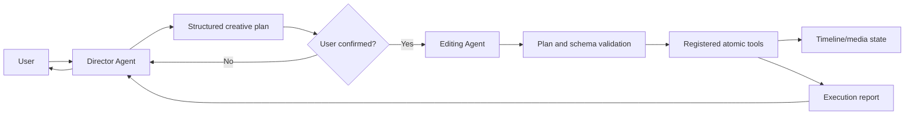

# Vistora Architecture and Responsibility Contracts

This document is the canonical description of Vistora's implemented architecture and its target responsibility boundaries. The vision chapters under `开发文档/` describe longer-term product direction; when those chapters and the current code differ, this document identifies the difference explicitly.

The keywords **MUST**, **MUST NOT**, **SHOULD**, and **MAY** define target contracts. A target contract is not evidence that the corresponding component is already implemented.

## Non-negotiable invariant

Vistora separates creative authority from mechanical execution:

1. A general-capability **Director Agent**, with specialized directing ability, owns user dialogue, requirement understanding, creative reasoning, and structured plan creation.
2. A plan MUST be explicitly confirmed by the user before execution.
3. An **Editing Agent** behaves as a constrained executor. It validates a confirmed plan and dispatches its steps without inventing new creative intent.
4. Only registered **atomic tools** may mutate timeline state or media files.



The Director may inspect read-only context and tool schemas. It MUST NOT call mutating tools, write timeline state, or render media. The Editing Agent MUST reject unconfirmed, malformed, unknown, or out-of-scope operations. It MUST NOT reinterpret the creative brief.

## Repository structure today

```text
src/
  main.py                    CLI entry point and hard-coded skill registry
  agent/
    llm_client.py            OpenAI-compatible model client
    operator_agent.py        Current hybrid conversational/tool-calling agent
  contracts/
    models.py                Versioned plan, confirmation, execution,
                              project, and atomic tool envelopes
  core/
    timeline.py              Timeline models and MoviePy/FFmpeg renderer
    timeline_manager.py      Persistence for the active timeline
  skills/
    base.py                  Pydantic validation and schema-export contract
    video_*.py               Registered atomic editing tools
  utils/
    hardware.py              Encoder and color metadata helpers
    proxy.py                 Reverse-proxy media generation
tests/
  reference_workflow.py      Test-only contract-to-tool regression harness
  run_validation.py          Synthetic end-to-end timeline/render validation
  test_architecture_boundaries.py
                              Static agent-boundary and registry checks
  test_contracts.py           Versioning, confirmation, compatibility,
                              serialization, and envelope checks
  test_reference_workflow.py  Repeatability, traceability, and media checks
```

There is no frontend application, browser UI, desktop GUI, API server, or UI state store in the repository. The only user interface is the command line.

## Implemented runtime

### CLI entry points

`src/main.py` exposes four commands:

| Command | Implemented behavior | Architectural status |
| --- | --- | --- |
| `list-skills` | Prints JSON schemas for the registered skills. | Compatible with both current and target designs. |
| `run-skill` | Parses JSON and executes one named registered skill. | Low-level/manual tool interface; bypasses Director confirmation by design. |
| `render` | Loads `TimelineConfig` and invokes `TimelineRenderer` directly. | Current compatibility path; it bypasses the target atomic-tool-only mutation boundary. |
| `chat` | Creates `OperatorAgent` with the registry and enters a conversational loop. | Prototype flow; not the target Director/Editing split. |

The registry is currently a module-level dictionary named `SKILLS`. It contains:

- `VideoAddClipSkill`
- `VideoModifyClipSkill`
- `VideoExportSkill`
- `VideoTimelapseSkill`
- `VideoClearTimelineSkill`

Registration is hard-coded. There is no plugin discovery, registry version, capability negotiation, or authorization layer.

### Current conversational flow

`OperatorAgent` currently performs several roles in one class:

1. It owns the chat history and user conversation.
2. It extracts video paths and reads duration metadata.
3. It gives the LLM every registered skill schema.
4. It asks the LLM to plan tool calls.
5. It immediately parses and executes those calls, up to ten iterations.
6. It returns tool results to the LLM and finally to the user.

This flow validates individual tool arguments through `BaseSkill.execute`, but it has no separate Director Agent, runtime confirmation gate, or constrained Editing Agent. It does not construct or consume the versioned contract models described below. Therefore `OperatorAgent` MUST be treated as a legacy prototype/hybrid, not as proof that the target agent contracts are enforced.

`LLMClient` is an OpenAI-compatible transport configured by `LLM_API_KEY`, `LLM_BASE_URL`, and `LLM_MODEL`. It is not a Director or Editing Agent by itself.

### Versioned contract infrastructure

`src/contracts/` implements schema infrastructure without changing the current runtime flow. All top-level envelopes use schema version `1.0.0`, reject unknown fields and unsupported versions, and carry stable IDs or references.

| Contract | Schema name | Implemented guarantee |
| --- | --- | --- |
| `DirectorPlan` | `vistora.director-plan` | Versioned creative intent, ordered proposed atomic operations, and a canonical SHA-256 digest. |
| `UserConfirmationRecord` | `vistora.user-confirmation` | Immutable decision referencing an exact plan ID, version, and digest. |
| `EditingExecutionPlan` | `vistora.editing-execution-plan` | Rejects missing, rejected, mismatched, incomplete, duplicate, or creatively drifted plan steps. |
| `TimelineProjectDocument` | `vistora.timeline-project` | Adds project ID, revision, and schema metadata while deterministically wrapping legacy timeline JSON. |
| `AtomicToolRequestEnvelope` | `vistora.atomic-tool-request` | Traces one confirmed execution step and validates arguments with the existing registered skill input model. |
| `AtomicToolResultEnvelope` | `vistora.atomic-tool-result` | Correlates a result to its request/execution/step and enforces consistent success/error state. |

These contracts are not wired into `OperatorAgent`, the CLI, `TimelineManager`, or tool execution yet. Their presence does not create a Director Agent or Editing Agent and does not authorize execution.

### Timeline state and rendering

`src/core/timeline.py` defines three Pydantic models:

- `ClipConfig`: source, trim, timeline placement, audio, speed, reverse, and rotation properties.
- `TrackConfig`: a named ordered list of clips.
- `TimelineConfig`: output dimensions, frame rate, and a mapping of tracks.

`TimelineManager` persists one active timeline at `.workspace/current_timeline.json`. It creates default video and audio tracks, loads and validates existing JSON, saves the full model, and deletes the file when reset. It has no project identifier, transaction boundary, concurrency control, revision check, history, or rollback.

`TimelineProjectDocument` is an opt-in versioned envelope around the existing `TimelineConfig`. An unwrapped legacy dictionary containing `width`, `height`, `fps`, and `tracks` remains valid for `TimelineConfig` and can also be parsed by `TimelineProjectDocument`; the wrapper assigns revision `1`, records `legacy.timeline.v0`, and derives a deterministic `project_legacy_*` ID from canonical timeline content. Current timeline persistence is intentionally unchanged.

`TimelineRenderer` consumes a `TimelineConfig` and writes media. It selects single-clip and multi-clip FFmpeg fast paths where possible and falls back to a MoviePy composite path. Hardware/color/proxy helpers live under `src/utils/`.

### Atomic skill contract today

Every registered skill subclasses `BaseSkill`, declares a Pydantic `input_model`, exports an OpenAI-compatible JSON schema through `get_schema`, and receives validated parameters through `execute`.

The implemented mutation ownership is:

| Skill | Timeline mutation | Media mutation |
| --- | --- | --- |
| `VideoAddClipSkill` | Appends a clip and saves the timeline. | May create a reverse proxy. |
| `VideoModifyClipSkill` | Updates a clip and saves the timeline. | May create a reverse proxy. |
| `VideoClearTimelineSkill` | Deletes the active timeline state. | None. |
| `VideoExportSkill` | May reset timeline state after export. | Renders the timeline to an output file. |
| `VideoTimelapseSkill` | None. | Writes a new timelapse file through FFmpeg. |

These are the only registered atomic mutation entry points. Tests may reset state directly as test-fixture setup. The CLI `render` command remains a documented nonconforming compatibility exception.

Versioned atomic request/result envelopes now define the target boundary and can validate request arguments against the existing registry. Current skills still return their existing dictionaries or raise exceptions; the runtime does not wrap them yet. Atomicity currently means a bounded operation exposed as one skill; it does not yet guarantee transactional rollback, idempotency, or crash recovery.

### Validation today

`tests/run_validation.py` creates a synthetic source clip, adds and modifies timeline clips through skills, verifies persisted state, exports a video, and verifies that the output exists. It exercises the timeline, proxy, and renderer paths but is a script rather than a comprehensive test suite.

`tests/test_architecture_boundaries.py` protects two current structural properties:

- agent modules do not directly import timeline state, renderers, proxy writers, hardware encoders, or `subprocess`;
- every object in the public registry is a `BaseSkill` with a unique, object-shaped JSON schema whose exported name matches its registry key.

This lightweight check does not claim that the missing Director, confirmation gate, or Editing Agent exists.

`tests/test_contracts.py` covers schema/version rejection, plan digests and confirmation mismatches, prohibition of unconfirmed execution, creative-step drift, JSON round trips, deterministic legacy timeline migration, existing registry/schema validation, and consistent tool result states. These are contract tests, not end-to-end Director or Editing Agent tests.

### Reference main-workflow regression

`tests/reference_workflow.py` is the deterministic reference for the intended main workflow while production Director and Editing Agents remain absent:

```text
generated 320x180/24 fps silent source
  -> fixed analyzed media facts
  -> DirectorPlan data constructed by the harness
  -> immutable matching UserConfirmationRecord
  -> EditingExecutionPlan derived without creative drift
  -> AtomicToolRequestEnvelope for each confirmed step
  -> registered atomic skill dispatch only
  -> AtomicToolResultEnvelope for each result
  -> exported H.264 silent media
  -> ffprobe metadata and trace verification
```

It uses only `VideoClearTimelineSkill`, `VideoAddClipSkill`, and `VideoExportSkill`. Fixed contract IDs, timestamps, relative generated paths, and a deterministic test clip UUID make two consecutive runs directly comparable. Generated source/output files and isolated timeline state live below `tests/test_data/` and remain ignored.

Run the focused automated regression:

```powershell
python -m pytest -q tests/test_reference_workflow.py
```

Or run the harness directly to print its trace summary:

```powershell
python tests/reference_workflow.py
```

This is fixture orchestration, not an implementation of either agent. Source generation and `ffprobe` are test setup/verification; every timeline or exported-media mutation in the workflow is dispatched through the registered atomic skills.

## Target contracts

### Director Agent

The Director Agent MUST:

- remain a general-capability assistant rather than a narrow command parser;
- own all user dialogue and clarify goals, audience, platform, tone, pacing, constraints, and acceptance criteria;
- inspect read-only project/media context and available tool schemas;
- produce a structured creative plan and explain material assumptions;
- revise or reject a draft in response to the user;
- record explicit user confirmation before handoff;
- receive the execution report and communicate results to the user.

The Director Agent MUST NOT execute atomic editing tools, mutate timelines, write media, or mark its own plan as user-confirmed.

### Structured creative plan

The implemented `DirectorPlan` contract includes:

```text
schema_name
schema_version
plan_id
plan_version
created_at
objective
requirements
assumptions[]
creative_direction
operations[]:
  operation_id
  tool_name
  arguments
  rationale
  expected_effect
outputs[]
risks[]
```

`UserConfirmationRecord` separately records `confirmed` or `rejected` and binds to `plan_id`, `plan_version`, and the plan's canonical SHA-256 digest. Only an `EditingExecutionPlan` carrying a matching `confirmed` record is valid. Later plan edits change the digest and invalidate the handoff. Free-form prose alone is not an executable plan.

### Editing Agent

The Editing Agent MUST:

- accept only a structured, confirmed plan;
- validate the plan version, confirmation binding, ordering, paths, outputs, and every operation against the current registry schema;
- reject unknown tools or arguments before mutation;
- dispatch operations in declared order through registered atomic tools only;
- stop according to an explicit failure policy and return a structured execution report;
- preserve the plan's creative intent without adding or silently changing operations.

The Editing Agent MUST NOT own general user dialogue, infer missing creative choices, call renderers or timeline managers directly, or bypass tool validation.

### Atomic tools

An atomic tool MUST:

- expose a stable unique name, description, versioned input schema, and declared side effects;
- validate all input before mutation;
- perform one bounded timeline or media operation;
- return a structured success or error result;
- be callable by the Editing Agent without hidden creative decisions.

Mutation-capable utilities and core objects are implementation details behind tools. They are not agent APIs.

## Current-to-target gap register

| ID | Gap | Evidence today | Required future outcome |
| --- | --- | --- | --- |
| G-01 | Director Agent absent | No Director class, prompt, plan model, or Director tests. | Add the general-capability Director without mutation authority. |
| G-02 | Contracts are not wired into a confirmation gate | Versioned plan/confirmation/execution models exist, but current tool calls execute immediately from the LLM response. | Make the future runtime produce these contracts and gate execution on the confirmed handoff. |
| G-03 | Operator combines incompatible roles | `OperatorAgent` owns dialogue, planning, and execution. | Separate/retire the hybrid behind Director and Editing contracts. |
| G-04 | Editing Agent absent | No constrained plan executor exists. | Add an executor that accepts only confirmed structured plans. |
| G-05 | Registry is hard-coded and unversioned | `SKILLS` is defined in `src/main.py`; request envelopes can validate against it but do not replace it. | Provide a reusable registry contract with schema/version metadata. |
| G-06 | Direct CLI render bypass | `render` instantiates `TimelineRenderer` directly. | Route mutations through an explicit atomic tool or clearly isolated maintenance interface. |
| G-07 | Timeline state lacks production safeguards | One JSON file; no revision, transaction, history, or rollback. | Add explicit project/revision and recovery semantics. |
| G-08 | Tool envelopes are not wired into execution | Versioned request/result/error models exist, but each skill still returns an ad hoc dictionary or raises. | Wrap runtime dispatch and declare side effects without breaking skill schemas. |
| G-09 | No frontend/UI | Repository contains only a CLI. | Design UI state around draft, confirmation, execution, and result phases. |
| G-10 | Production agent gates remain untested | The reference harness covers contract confirmation, atomic dispatch, traceability, and media output, but no Director or Editing runtime exists. | Add agent-level gate tests as those components are implemented. |

This gap register is descriptive. Closing any gap requires a separate approved implementation task.
