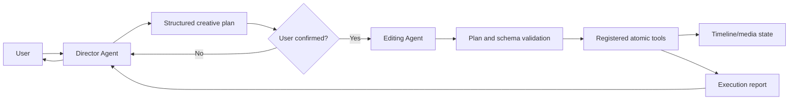

# Vistora Architecture and Responsibility Contracts

This document is the canonical description of Vistora's implemented architecture and its target responsibility boundaries. The vision chapters under `开发文档/` describe longer-term product direction; when those chapters and the current code differ, this document identifies the difference explicitly.

The immutable original optimization definitions live in [ROADMAP.md](ROADMAP.md), with evidence and status in [roadmap-status.json](roadmap-status.json). Those files are the sole authority for O1–O32 numbering; architecture sections and internal `BATCH-*` identifiers may explain implementation but cannot redefine the roadmap.

The keywords **MUST**, **MUST NOT**, **SHOULD**, and **MAY** define target contracts. A target contract is not evidence that the corresponding component is already implemented.

## Non-negotiable invariant

Vistora separates creative authority from mechanical execution:

1. A general-capability **Director Agent**, with specialized directing ability, owns user dialogue, requirement understanding, creative reasoning, and structured plan creation.
2. A plan MUST be explicitly confirmed by the user before execution.
3. An **Editing Agent** behaves as a constrained executor. It validates a confirmed plan and dispatches its steps without inventing new creative intent.
4. Only registered **atomic tools** may mutate timeline state or media files.



The Director may inspect read-only context and tool schemas. It MUST NOT call mutating tools, write timeline state, or render media. The Editing Agent MUST reject unconfirmed, malformed, unknown, or out-of-scope operations. It MUST NOT reinterpret the creative brief.

## Repository structure today

```text
src/
  main.py                    CLI and production composition entry point
  atomic_runtime/
    models.py                Frozen registry/descriptor/caller contracts
    registry.py              Immutable deterministic skill registry
    gateway.py               Validated, policy-bound atomic dispatcher
    composition.py           Sole production thirteen-skill composition root
  agent/
    director_agent.py        Production dialogue/brief/proposal boundary
    editing_agent.py         Production confirmed-plan mechanical executor
    llm_client.py            OpenAI-compatible model client
    operator_agent.py        Legacy hybrid conversational/tool-calling prototype
  director/
    models.py                Frozen brief, turn, proposal, and ledger contracts
    adapters.py              Provider-neutral structured reasoning boundary
    context.py               Detached timeline/material/tool-schema projection
    store.py                 Hash-chained atomic Director session store
    query.py                 Browser-safe deterministic history projection
  product_entry/
    models.py                Frozen product commands/events/views
    store.py                 Hash-chained idempotency/session ledger
    service.py               Director/review/confirmation/Editing composition
    factory.py               Current-workspace production entry wiring
  material_requirements/
    models.py                Frozen requirement decisions and ledger records
    store.py                 Hash-chained atomic requirements sidecar
    service.py               Read-only review and explicit decision boundary
  creation_planning/
    agent.py                 Confirmed-requirements production planner
    adapters.py              Provider-neutral JSON-only reasoning boundary
    models.py                Production plan/review/confirmation contracts
    service.py               Exact review and independent decision boundary
    store.py                 Hash-chained creation-planning ledger
  material_production/
    models.py                Versioned adapter/job/artifact/catalog contracts
    adapters.py              Provider-neutral registry and local test/import adapters
    validation.py            Staging confinement and ffprobe quality checks
    service.py               Confirmed orchestration and human acceptance
    store.py                 Hash-chained run ledger and atomic material catalog
  contracts/
    models.py                Versioned plan, confirmation, execution,
                              project, manual-edit, and tool envelopes
  traceability/
    models.py                Versioned append-only provenance contracts
    recording.py             Confirmed atomic/manual effect correlation
    query.py                 Revision-aware plan/evidence/clip queries
    store.py                 Durable timeline-adjacent trace sidecar
  timeline_query/
    models.py                Immutable, versioned timeline read models
    service.py               Deterministic read-only snapshot construction
  timeline_edit/
    models.py                Frozen exact-ID edit inputs/effect outcomes
    engine.py                Detached deterministic video/audio semantics
    transaction.py           Shared fsync + atomic replacement boundary
  media_analysis/
    models.py                Versioned thumbnail/waveform read contracts
    service.py               Read-only FFmpeg extraction and bounded cache
  timeline_preview/
    server.py                Loopback snapshot/media and confirmed-edit server
    static/                  Framework-free timeline preview UI
  plan_review/
    models.py                Frozen v1 proposed-plan and diff contracts
    engine.py                Detached registry-validated simulator
    query.py                 Revision-aware plan/clip/evidence queries
    service.py               Current/stale/invalid browser envelope
  workflow/
    models.py                Frozen v1 review/execution/rollback records
    store.py                 Hash-chained atomic project ledger
    service.py               Confirmed dispatch and reviewed restore boundary
    query.py                 Browser-safe deterministic history projection
  core/
    timeline.py              Timeline models and MoviePy/FFmpeg renderer
    timeline_manager.py      Persistence for the active timeline
  skills/
    base.py                  Pydantic validation and schema-export contract
    video_*.py               Registered atomic editing tools
  utils/
    hardware.py              Encoder and color metadata helpers
    proxy.py                 Reverse-proxy media generation
tests/
  reference_workflow.py      Test-only contract-to-tool regression harness
  run_validation.py          Synthetic end-to-end timeline/render validation
  test_architecture_boundaries.py
                              Static agent-boundary and registry checks
  test_editing_agent.py       Production gate, failure, concurrency, and
                              restart-recovery checks
  test_director_agent.py      Clarification, readiness, evidence, model error,
                              review handoff, persistence, and boundary checks
  test_contracts.py           Versioning, confirmation, compatibility,
                              serialization, and envelope checks
  test_reference_workflow.py  Repeatability, traceability, and media checks
  test_timeline_snapshot.py   Read isolation, stability, compatibility,
                              reference, and boundary checks
  test_media_analysis.py      Versioning, determinism, cache, alignment,
                              isolation, and import-boundary checks
  test_timeline_preview.py    Endpoint, media, draft/apply, and boundary checks
  test_manual_edits.py        Manual contracts, confirmation, persistence,
                              stale-state, and rollback checks
  test_traceability.py        Linkage, queries, legacy/stale/orphan/manual,
                              redaction, and round-trip checks
  test_workflow.py             Ledger integrity, gates, execution, recovery,
                               rollback, history API, and redaction checks
  test_material_production.py  Confirmation, adapters, staging, catalog,
                               recovery, tamper, and boundary checks
```

The repository now contains production Director, Creation Planning, Material Production, and constrained Editing Agent boundaries plus a framework-free loopback product entry. The Director can define no-material requirements; after their separate confirmation the Creation Planning Agent can propose a production plan; after a second independent confirmation the Material Production Orchestrator can use configured provider-neutral adapters, validate staged artifacts, and require human acceptance before catalog registration. No online provider is configured by default. There is still no desktop GUI or remote API server. Transient browser state is reconstructed from separate append-only Director, material-requirements, creation-planning, material-production, catalog, product-session, provenance, and workflow stores.

## Implemented runtime

### CLI entry points

`src/main.py` exposes six commands:

| Command | Implemented behavior | Architectural status |
| --- | --- | --- |
| `list-skills` | Prints the durable production registry reference plus stable input/output schemas and capability/side-effect descriptors. | Uses the same immutable registry as Director, review, workflow, Editing Agent, and product entry. |
| `run-skill` | Parses JSON, builds an explicitly acknowledged low-level request, and dispatches through `AtomicExecutionGateway`. | Compatibility interface without Director/workflow confirmation; still registry/schema/policy/result validated. |
| `render` | Loads `TimelineConfig` and invokes `TimelineRenderer` directly. | Current compatibility path; it bypasses the target atomic-tool-only mutation boundary. |
| `chat` | Creates `OperatorAgent` with the registry and enters a conversational loop. | Prototype flow; not the target Director/Editing split. |
| `preview` | Starts the loopback-only timeline snapshot UI, optionally for a supplied timeline document and explicit media roots. Current-workspace mode can submit an explicitly confirmed manual proposal to one registered atomic tool. | The browser and HTTP handler never mutate directly; external documents remain read-only. |
| `studio` | Starts the loopback production entry that composes Director dialogue, review, explicit decision, confirmed Editing execution, history, and reviewed rollback. | Primary existing-material product path; it does not use `OperatorAgent`. |

`src/atomic_runtime/` provides the sole production registry composition root.
It constructs a fresh immutable `AtomicSkillRegistry` containing:

- `VideoAddClipSkill`
- `VideoModifyClipSkill`
- `VideoExportSkill`
- `VideoTimelapseSkill`
- `VideoClearTimelineSkill`
- `VideoApplyManualEditsSkill`
- `VideoRestoreTimelineCheckpointSkill`
- `VideoSplitClipSkill`
- `VideoTrimClipSkill`
- `VideoMoveClipSkill`
- `VideoInsertOverwriteClipSkill`
- `VideoRemoveClipSkill`
- `VideoSetClipPropertiesSkill`
- `TimelineManageTrackSkill`
- `TimelineSetClipLinkSkill`
- `AudioAnalyzeLoudnessSkill`
- `AudioApplyDuckingSkill`
- `AudioSetClipPropertiesSkill`
- `AudioSetTrackMixSkill`
- `AudioSetVolumeEnvelopeSkill`
- `SubtitleManageTrackSkill`
- `SubtitleEditCueSkill`
- `SubtitleImportSkill`
- `SubtitleExportSidecarSkill`
- `VideoSetClipTransformSkill`
- `VideoSetClipColorSkill`
- `VideoCopyClipVisualSkill`

The registry has stable ID/version/revision, deterministic input-schema and
full-descriptor digests, and frozen per-skill metadata for exact input/output
schemas, side effects, mutation, actual transactionality, retry/replay safety,
preview support, rollback/compensation, and required capabilities.
`AtomicExecutionGateway` checks exact registry/project/confirmation binding,
input and result schemas, and caller side-effect policy before dispatch. It
normalizes typed envelopes, redacts paths/exceptions, serializes concurrent
idempotent requests, and never resolves a tool outside the registry.

There is deliberately no plugin discovery in this step. `src/main.py` retains
the name `SKILLS` only as a mutable compatibility view for the legacy
`OperatorAgent` and historical integrations; production `studio`, `preview`,
Director context, plan review, workflow/Editing Agent, manual apply, rollback,
and CLI schema/execution consume `PRODUCTION_REGISTRY`.

### Current conversational flow

`OperatorAgent` currently performs several roles in one class:

1. It owns the chat history and user conversation.
2. It extracts video paths and reads duration metadata.
3. It gives the LLM every registered skill schema.
4. It asks the LLM to plan tool calls.
5. It immediately parses and executes those calls, up to ten iterations.
6. It returns tool results to the LLM and finally to the user.

This flow validates individual tool arguments through `BaseSkill.execute`, but it has no separate Director Agent, confirmation integration, or constrained Editing Agent. It does not construct or consume the versioned workflow service described below. Therefore `OperatorAgent` MUST be treated as a legacy prototype/hybrid, not as proof that the target agent contracts are enforced. The separate fixture/application workflow is gated, but it is not wired into `OperatorAgent`.

`LLMClient` is an OpenAI-compatible transport configured by `LLM_API_KEY`, `LLM_BASE_URL`, and `LLM_MODEL`. It is not a Director or Editing Agent by itself.

### Versioned contract infrastructure

`src/contracts/` implements schema infrastructure without changing the current runtime flow. All top-level envelopes use schema version `1.0.0`, reject unknown fields and unsupported versions, and carry stable IDs or references.

| Contract | Schema name | Implemented guarantee |
| --- | --- | --- |
| `DirectorPlan` | `vistora.director-plan` | Versioned creative intent, typed opaque source-evidence references, ordered proposed atomic operations, and a canonical SHA-256 digest. |
| `UserConfirmationRecord` | `vistora.user-confirmation` | Immutable decision referencing an exact plan ID, version, and digest. |
| `EditingExecutionPlan` | `vistora.editing-execution-plan` | Rejects missing, rejected, mismatched, incomplete, duplicate, or creatively drifted plan steps. |
| `TimelineProjectDocument` | `vistora.timeline-project` | Adds project ID, revision, and schema metadata while deterministically wrapping legacy timeline JSON. |
| `AtomicToolRequestEnvelope` | `vistora.atomic-tool-request` | Traces one confirmed execution step plus its exact evidence references and validates arguments with the existing registered skill input model. |
| `AtomicToolResultEnvelope` | `vistora.atomic-tool-result` | Correlates a result to its request/execution/step and registry digest; enforces consistent success/error/partial/recovery state and records idempotent replay. |
| `ManualEditProposal` | `vistora.manual-edit-proposal` | Identifies a user-authored, snapshot-bound batch of video clip timing/order/removal changes; it is explicitly not a Director plan. |
| `ManualEditConfirmationRecord` | `vistora.manual-edit-confirmation` | Immutably binds a local user's decision to one exact manual proposal ID and digest. |
| `ManualEditReview` | `vistora.manual-edit-review` | Provides structured before/after changes after validation and before any write. |
| `ProposedEditingExecutionPlan` | `vistora.proposed-editing-execution-plan` | Exact, non-executable projection of every Director operation before confirmation. |
| `PlanDiffRequest` | `vistora.plan-diff-request` | Binds exact snapshot, Director plan, proposed execution, registry schemas, and opaque media facts. |
| `PlanDiffDocument` | `vistora.plan-diff` | Deterministic changes, evidence/provenance, warnings, step status, and net summary. |
| `PlanReviewEnvelope` | `vistora.plan-review-envelope` | Browser-safe `current`, `stale`, `invalid`, or `unavailable` freshness state. |

The Director contracts are wired into the separate production `DirectorAgent`, not into `OperatorAgent`. Its proposal is directly consumable by the read-only review service, while the production `EditingAgent` can consume only a separately persisted exact confirmation binding. This does not authorize `OperatorAgent`, the Director, or the browser to execute unconfirmed Director intent. The separate manual-edit contracts are wired only into the local preview application service and the dedicated confirmed atomic skill described below; they do not represent Director decisions.

### Production Director Agent boundary

`src/agent/director_agent.py` is the implemented general-capability creative entry boundary. A provider-neutral `DirectorReasoningAdapter` supplies structured reasoning; the production OpenAI-compatible adapter requests JSON only and exposes no tool callback, while tests use deterministic fakes. The Agent accepts natural-language turns, but only frozen `DirectorReasoningOutput` objects cross into the domain.

```text
user turn
  -> exact detached DirectorReadContext
  -> structured reasoning adapter (no tools)
  -> schema, safety, evidence, snapshot, and registry validation
  -> versioned CreativeBriefVersion + readiness
  -> optional DirectorPlan + ProposedEditingExecutionPlan
  -> deterministic read-only PlanReviewService
  -> append-only DirectorSessionLedger
  -> stop before confirmation
```

The creative brief covers objective, audience, platform, target duration,
style, narrative, pacing, must/must-not constraints, delivery requirements,
existing material/evidence IDs, assumptions, unresolved questions, and
acceptance criteria. Each new brief embeds a strict `MaterialStateAssessment`
bound to the exact snapshot, brief digest, and deterministic material-facts
digest. Stable ID sets distinguish `materials_complete`,
`materials_incomplete`, and `no_materials`; missing/unsupported/error facts and
missing evidence are recorded rather than folded into generic clarification.
Legacy ledgers without this optional nested record remain readable. A normal
edit plan can be proposed only from a complete brief with a complete observed
material set and exact evidence references. A later accepted revision
increments the brief and plan versions without changing the stable plan
identity; withdrawal is audited.

The Agent rejects malformed or extra model fields, requested tool calls, secrets or absolute paths, unobserved evidence, cross-context IDs, unavailable/unsafe tools, stale snapshots, and registry-schema drift. Structured-output retries are bounded; provider timeout, provider failure, malformed output, and stale context remain explicit report states rather than being presented as successful reasoning. Session records persist only redacted user text and browser-safe domain data in a hash-chained, atomically replaced `*.director.json` sidecar with optimistic revision checks and tamper detection.

The Director cannot create a user confirmation, import or call the Editing Agent or workflow service, dispatch a registered skill, write timeline/media, render/export, roll back, or decide how a confirmed material requirement is produced. `proposal_ready` and `material_requirements_ready` mean ready for separate review only. Production planning belongs to the constrained Creation Planning Agent; generation, AI packaging, and richer atomic editing remain outside the implemented boundary.

### Initial and supplemental material requirements boundary

When the read context contains no observed materials, missing creative fields
still produce `needs_clarification`. Once the objective, audience, platform,
duration, style, narrative/pacing, delivery constraints, and acceptance
criteria are complete, readiness becomes
`ready_for_material_requirements`. A structured reasoning response may then
propose a frozen `MaterialRequirementsPlan`; it may not propose a normal
timeline-edit plan.

The plan binds the exact creative-brief version/digest, the exact empty
snapshot, and a canonical no-material fact digest. Its typed items cover video
shots, audio, images, narration, and reference assets with purpose, narrative
position, format/duration, continuity, must/must-not constraints, acceptance
criteria, priority, dependencies, alternatives, and explicit known/unknown
budget and deadline values. Planned IDs are not material IDs and are never
inserted into source evidence.

`src/material_requirements/` records proposals, deterministic item-level
added/removed/changed reviews, separate immutable confirmations/rejections,
and withdrawals. The hash-chained store rejects drift, replay, duplicate
decisions, stale revision, unknown dependency, conflicting constraints, and
tampering. It performs no generation, import, media write, timeline mutation,
or Agent invocation. The production UI exposes only its path-safe checklist
and explicit review/decision actions.

O26 adds `src/material_feedback/` without changing those confirmation gates.
`MaterialShortfallReport` is a frozen, digest-bound fact from either an exact
plan review or an exact confirmed editing execution. It records the current
snapshot, source plan/version/digest, review or confirmation/execution IDs,
stable missing requirement IDs, affected entity IDs, evidence gaps, reasons
and acceptance criteria. It contains no source path and does not claim that a
planned asset exists.

An open current report is projected into `DirectorReadContext`. Only then may
the Director issue a `supplemental_shortfall` `MaterialRequirementsPlan`, whose
items must exactly cover the report. The separate requirements and production
confirmations remain mandatory. A versioned hash-chained
`*.material-feedback.json` ledger records four legal transitions:
`shortfall_recorded -> requirements_linked -> production_linked -> resolved`.
Resolution verifies one-to-one accepted catalog material and exact
requirements-plan, production-plan and production-run provenance. Stale,
duplicate, cross-project, incomplete and tampered chains fail closed. The
product view exposes only the browser-safe state; it cannot create evidence,
confirm, invoke a provider or mutate the timeline.

### Creation-planning boundary

`src/creation_planning/` receives only an exact confirmed material-requirements
binding. `CreationPlanningAgent.prepare_request` resolves that immutable
confirmation and freezes its material-ledger revision, requirements plan and
review digests, creative-brief digest, empty-snapshot digest, and a sorted
versioned capability-registry digest. `plan` re-resolves both bindings before
and after the adapter boundary. It rejects stale or cross-binding output,
unknown requirement/capability IDs, falsely available capabilities, absolute
paths, skill/tool-call requests, invalid task dependencies, and schema drift.

The resulting `MaterialProductionPlan` is a frozen, provider-neutral
description of how each Director requirement could be produced. It covers
generate/capture/import/library/manual methods, structured prompts, reference
and continuity anchors, capability rather than vendor names, media
specifications, reproducibility settings, dependency DAGs and batches,
known/unknown cost and time estimates, quality gates, retry/alternative
strategies, and path-safe delivery specifications. A task using an unavailable
capability must be `needs_user_input` or `unsupported` with an explicit
limitation.

`CreationPlanningService` persists plan versions, deterministic task changes,
separate immutable confirmation/rejection, and withdrawal in an atomically
replaced hash-chained `*.creation-planning.json` sidecar. It performs no media
production, provider invocation, material import, timeline mutation,
confirmation on behalf of the user, or editing execution. The product entry
can display and decide this plan. Only the separately confirmed production
boundary below may consume it.

### Material-production and catalog boundary

`src/material_production/` is the constrained provider/application boundary.
`MaterialProductionAgent` is its non-creative production executor: it accepts
one exact frozen run request, never invents tasks, and delegates only to
`MaterialProductionOrchestrator`.
`MaterialProductionOrchestrator.prepare_request` resolves an exact confirmed
production plan and freezes the creation-planning ledger revision, material
confirmation, plan/review/capability digests, and a sorted versioned adapter
registry with input/result schema digests. Starting a run revalidates all of
those bindings before any adapter submission.

Adapters expose provider-neutral `submit`, `poll`, `cancel`, and result
contracts with opaque job/provider references, idempotency keys, attempts,
progress, explicit cost state, timeout/rate-limit/failure/partial/recovery
states, and bounded capability metadata. Domain contracts contain no vendor
SDK types. The single production factory registers the provider-neutral
capability names `image_generation`, `video_generation`, `voice_synthesis`,
`music_generation`, `audio_generation`, `asset_search`, `local_capture`,
`user_material_request`, and `manual_import`. All provider-backed capabilities
are explicit unconfigured placeholders; manual import is unconfigured without
an opaque-token resolver. The local user-request adapter records only
`needs_input`, creates no artifact, and requires a separately confirmed import
after the user supplies media. Deterministic local image/video/audio adapters
are exported for tests only and are never registered by the production
factory. No credentials are collected or submitted.

Artifacts first land below an ignored project-scoped staging root. Validation
rejects traversal and verifies request/task/requirement linkage, size/hash/
MIME, container, codecs, duration, dimensions, frame rate, and audio metadata.
A failed artifact cannot be accepted. A passing artifact still remains staged
until a separate human decision. Acceptance runs the versioned local ingest
pipeline: a full FFmpeg decode check, deterministic normalized transcode,
bounded proxy generation, unified stream/duration/dimension/audio analysis,
stable technical/workflow tags, and a digest-bound quality report. Video uses
H.264/AAC MP4 derivatives, audio uses PCM WAV plus AAC/M4A, and images use PNG
plus bounded JPEG; source artifacts are never modified. The catalog store
publishes original and derivative files as one create-new set and removes all
published files if its atomic manifest update fails. It records opaque IDs,
production provenance, validation/decision IDs, derivative hashes, analysis,
tags, quality, origin, license/usage limitations, and explicit cost state.
Legacy catalog payloads first pass their original integrity digest, then gain
empty enrichment defaults in memory; no historical facts are invented. The
append-only production ledger and catalog both use digest integrity and atomic
replacement; tampering fails closed.

Only accepted catalog entries are projected into the Director's next detached
read context. They use browser-safe `material://source_*` references and
whole-material evidence; no filesystem path enters the Director ledger or
browser API. Catalog acceptance does not add a clip. A subsequent Director
proposal must still pass deterministic review, independent confirmation, and
the Editing Agent. `VideoAddClipSkill` and
`VideoInsertOverwriteClipSkill`, at the atomic mutation boundary, resolve an
accepted catalog URI to its managed file; unknown or unaccepted URIs fail.

The loopback product state machine adds production start/poll/cancel/retry,
artifact accept/reject, catalog status, and return-to-Director actions. The
browser calls only this application service and receives path-redacted views.
Real online AI adapters, provider credentials, automatic license approval,
external artifact cleanup, complex AI effects, and more mature atomic editing
capabilities remain unimplemented.

### Production product-entry composition

`src/product_entry/` closes the existing-material composition gap without
merging roles. `ProductionEntryService` is a state machine over injected
`DirectorAgent`, `WorkflowApplicationService`, and `EditingAgent` instances.
Its browser-safe state proceeds through dialogue/clarification/material need,
proposal, persisted review, explicit confirmation or rejection, confirmed
execution, and separately reviewed/confirmed rollback. It has no timeline,
renderer, skill implementation, or registry-dispatch import.

Every command carries the exact session ID, logical project ID, expected
product revision, action, actor, target ID, and unique request ID. A
hash-chained `*.product.json` sidecar atomically records successful
transitions. Exact duplicate requests are idempotent; changed-payload replay,
stale revision, illegal transition, cross-session/project target, workflow
drift, and concurrent actions fail closed. Workflow confirmation and execution
services revalidate their own snapshot/plan/diff/registry bindings again.

The loopback `/api/product` endpoint returns only path-safe projections and an
ephemeral CSRF token. `/api/product/actions` requires that token, accepts only
JSON, rejects non-loopback origins, and delegates to the product service.
Double-clicks are disabled in the browser and still protected by server-side
request IDs/revision locks. The UI cannot fabricate a confirmation or invoke a
skill. Refresh/restart reloads ledgers; an abandoned workflow run continues to
use the existing `recovery_required` semantics.

### Pre-confirmation plan-review boundary

`src/plan_review/` compares one proposed Director plan against one exact detached `TimelineSnapshot`. `PlanDiffRequest` rejects cross-project proposals, duplicate or creatively drifted steps, incomplete snapshot references, and duplicate media facts. `RegistrySchemaReference` canonically digests the sorted registered tool names and their Pydantic input schemas. Generation rejects snapshot, plan, execution, or registry drift before simulation.

`PlanDiffEngine` validates every step through the registered tool's input model but never invokes `execute` or `run`. It imports no timeline manager, skill implementation, renderer, proxy/media engine, or trace writer. Simulation uses copied snapshot read models and emits stable IDs, direct/consequential/informational effects, before/after safe clip states, plan operation and proposed step IDs, typed evidence locators, and current provenance health. Current adapters accurately represent:

- non-reverse `VideoAddClipSkill` using caller-supplied opaque duration/dimension facts, a clearly provisional clip ID, and the real first-clip canvas adoption;
- `VideoModifyClipSkill` speed, rotation, and non-proxy property effects;
- exact-ID split, trim, move, insert/overwrite, lift/ripple delete, and
  playback-property semantics through the detached `TimelineEditEngine`,
  including same-track consequential effects and retained overwrite sides;
- `VideoClearTimelineSkill` removals plus its default canvas/frame-rate reset;
- `VideoExportSkill` as an export-only effect plus consequential removals and project reset when `clear_timeline_after` is set.

Reverse proxy generation, timelapse generation, user-authored `VideoApplyManualEditsSkill`, and any registered tool lacking a detached adapter are blocked or marked unsupported. An unregistered tool, invalid argument, invalid trim/range, or stale/schema-drifted request is rejected. The engine never probes sources, renders, writes output, appends trace records, creates confirmations, or dispatches skills. `PlanDiffQuery` provides stable plan-to-changes, clip-to-changes, evidence-to-changes, and warning summaries with an optional exact snapshot freshness guard.

The diff is proposed-state review, not provenance history. Recorded provenance
remains the source of truth; review only copies its detached summary onto
affected current clips. Explicit proposed clip IDs remain unapplied identities
until confirmed execution and never claim applied provenance.

### Persistent workflow and recovery boundary

`src/workflow/` persists the state transitions that the plan-review boundary intentionally does not create. Its frozen version `1.0.0` records cover exact Director plan versions, review sessions, immutable confirmations/rejections, execution-run snapshots with per-step atomic envelopes, integrity-checked project checkpoints, rollback proposals/reviews/confirmations/runs, and typed terminal errors. It reuses `DirectorPlan`, `UserConfirmationRecord`, `EditingExecutionPlan`, plan-diff references, timeline project documents, and atomic envelopes instead of redefining them.

`current_timeline.workflow.json` is project-scoped and append-only. Every entry has a contiguous sequence, previous-entry digest, and canonical content digest; the ledger carries an aggregate integrity digest. The store holds an exclusive project lock, checks an expected ledger revision, writes and `fsync`s a same-directory temporary file, then atomically replaces the sidecar. Unsupported migration/version input, corruption, chain tampering, cross-project records, duplicate/replayed confirmations, and illegal state transitions fail closed.

The ledger project ID is a stable logical workspace identity. Each review and checkpoint separately carries the exact snapshot/content-derived project ID, revision, snapshot ID, and timeline digest. This distinction preserves multi-plan history when editing changes a legacy `project_legacy_*` identity, while every confirmation/execution still revalidates the exact reviewed snapshot.

The implemented execution state path is:

```text
persisted plan version
  -> exact reviewed PlanDiffDocument
  -> explicit immutable confirmed/rejected decision
  -> execution_pending -> running
  -> per-step registry validation and atomic dispatch
  -> succeeded | failed | partial | recovery_required
```

`WorkflowApplicationService` regenerates the exact review and rechecks snapshot, plan, proposed execution, diff, and registry-schema digests immediately before execution. It dispatches in order through `BaseSkill.execute`, records each correlated result/provenance/checkpoint, and stops on the first failure. Abandoned pending/running records can only recover to `recovery_required`; they are never inferred as successful. This service is the mutation-capable application boundary used by fixtures, the local workflow panel, and the production Editing Agent.

### Production Editing Agent execution boundary

`src/agent/editing_agent.py` is the implemented production mechanical executor. It has no LLM client, prompt, chat history, Director logic, timeline manager, renderer, skill implementation, trace writer, or registry-dispatch code. Its only mutation-capable dependency is an injected `WorkflowApplicationService`.

The boundary is deliberately two-phase:

```text
persisted confirmed workflow
  -> prepare exact ConfirmedExecutionBinding
  -> frozen EditingAgentExecutionRequest
  -> revalidate ledger revision + plan/review/confirmation/diff
  -> revalidate current snapshot + registry schemas
  -> WorkflowApplicationService ordered atomic dispatch
  -> frozen EditingAgentExecutionReport
```

`ConfirmedExecutionBinding` includes the exact project and ledger revision, confirmation and review IDs, Director plan ID/version/digest, proposed execution digest, reviewed diff digest, timeline snapshot reference, and registry/schema digest. Both the Agent and application service compare the complete binding, and the service repeats the freshness checks under its optimistic exclusive workflow lock before any atomic request is dispatched.

The Agent returns no prose interpretation. Its versioned report carries exact run/step/request/result linkage, before/after snapshots, ledger revisions, and the persisted terminal state. Rejected confirmations, replay, stale state, registry drift, tampering, or concurrent work return a rejected report without a claimed run. Atomic failures preserve the service's `failed` or `partial` result; trace persistence failure remains `recovery_required`. A restart method delegates to the ledger recovery transition and never guesses that an abandoned run succeeded.

`OperatorAgent` remains a compatibility prototype. It still combines conversation, LLM planning, and immediate tool calls and is not upgraded, wrapped, or relabeled by this production execution boundary.

Rollback is a second workflow, never an automatic failure handler. The service requires the current timeline to equal the execution's latest checkpoint, creates a deterministic current-to-start-checkpoint proposal, records its limitations, and requires a separate immutable decision. Only `VideoRestoreTimelineCheckpointSkill` mutates during restore. That skill verifies the exact current checkpoint, atomically replaces the legacy timeline JSON, verifies the restored digest, and restores the prior bytes if validation fails. It does not delete exports, reverse generated media, or erase the original execution/provenance history. Manual edits or any other current-state drift invalidate rollback and require a new safe review; unsupported media-file inverses fail closed.

### Timeline state and rendering

`src/core/timeline.py` defines the compatible media timeline models plus a
separate first-class subtitle domain:

- `ClipConfig`: stable clip ID, source, explicit `video|image|sticker` visual kind, trim/declared static duration, timeline placement, optional explicit link-group ID, legacy audio flags/volume, frozen versioned clip-audio settings, speed, declarative reverse, optional versioned video-only freeze-frame state, legacy rotation, neutral-by-default frozen visual transform/color properties, optional frozen visual-automation curves, an ordered bounded mask stack, and a bounded compositing declaration. Static graphics are silent speed-1 visual clips and never masquerade as timed video sources.
- `TrackConfig`: stable track ID, video/audio kind, role, unique order, enabled/muted/locked state, frozen versioned mix settings, and an ordered list of clips.
- `SubtitleTrackConfig` / `SubtitleCue` / `SubtitleWord` / `SubtitleStyle`: frozen versioned subtitle/title lanes, stable timed cues, optional exact word evidence, and safe logical-font styling, separate from media clips.
- `TimelineTransition`: a frozen version `1.0.0` exact-cut entity with stable ID, exact track/from/to clip IDs, whitelisted video/audio kind and parameters, bounded duration/alignment, enabled state, and reciprocal explicit audio pairing.
- `TimelineConfig`: schema version `2.0.0`, output dimensions, frame rate, an arbitrary mapping of video/audio tracks, an optional mapping of subtitle/text tracks, and an optional mapping of first-class transitions.

`TimelineManager` persists one active timeline at `.workspace/current_timeline.json`. It creates default primary video and audio tracks, deterministically migrates legacy fixed-track JSON, loads and validates schema-v2 JSON, saves the full model, and deletes the file when reset. Native v2 documents reject duplicate track IDs/order and clip IDs. It has no first-class project identifier or canonical project-store revision; guarded workflow transactions/checkpoints remain separate.

`TimelineProjectDocument` is an opt-in versioned envelope around the existing `TimelineConfig`. An unwrapped legacy dictionary containing `width`, `height`, `fps`, and `tracks` remains valid for `TimelineConfig` and can also be parsed by `TimelineProjectDocument`; the wrapper assigns revision `1`, records `legacy.timeline.v0`, and derives a deterministic `project_legacy_*` ID from canonical timeline content. Current timeline persistence is intentionally unchanged.

### Read-only timeline boundary

`src/timeline_query/` is the stable library boundary for future timeline/player visualization. `TimelineSnapshotService.snapshot` accepts a `TimelineConfig`, legacy timeline dictionary, or `TimelineProjectDocument`; `snapshot_current` delegates only to `TimelineManager.get_current_timeline`. Neither method saves, resets, renders, executes a skill, probes media, or writes files.

The returned `vistora.timeline-snapshot` schema is version `11.0.0`. Its frozen, recursively detached read models expose:

- snapshot, project, revision, source-schema, migration, and timeline-digest identity;
- output width, height, and frame rate;
- every configured track with its mapping key, stable ID, video/audio kind, role, unique order, enabled/muted/locked state, gain/mix mute/pan, clips, count, and derived duration;
- every clip with its configured ID, explicit video/image/sticker kind, optional explicit link-group ID, source reference, trim, placement, speed-adjusted duration, legacy audio flags/volume, explicit audio content role, dB gain, mute, pan, fades, stable linear envelope, applied loudness/ducking evidence, reversal/legacy rotation, frozen transform/color state, frozen visual automation/keyframes, bounded masks/mask keyframes/compositing state, and deterministic visual/automation/mask digests;
- every subtitle/text track and subtitle/title cue with stable IDs, language/speaker metadata, timing, optional stable word ranges/confidence, enable/lock/overlap state, safe style data, counts, and derived duration;
- every transition with stable exact-cut identities, media/kind, bounded duration/alignment, controlled parameters, enabled state and reciprocal audio policy, without any source path;
- a detached `vistora.clip-provenance-summary` for each clip, reporting recorded origin, latest change origin, mapping health, confirmed plan/operation/step/request/result identity, execution status, and browser-safe evidence locators;
- aggregate media/subtitle track, clip/cue/transition, video/audio counts, timeline duration, and empty state.

Track order is deterministic by unique numeric `order`, then stable track ID
and mapping key. Clip order is deterministic by timeline start and stable
clip ID after exact-ID edits. Subtitle cues use deterministic start/end/ID
order. All configured video/audio and subtitle/text tracks are exposed
without collapsing them into fixed lanes. The read layer does not invent
effect tracks or inferred link membership.

Legacy timelines receive the existing content-derived `project_legacy_*` identity and revision `1`. A native `TimelineProjectDocument` retains its explicit project ID and revision. Consumers that need optimistic consistency can supply a `TimelineSnapshotReference`; a mismatched project or revision fails before data is returned. Configured source paths are stable references only and are not checked for existence, keeping repeated snapshots independent of machine and filesystem state.

### Traceability boundary

`src/traceability/` adds provenance without changing legacy timeline JSON or rendering semantics. `current_timeline.trace.json` is a strict version `1.0.0` append-only sidecar. Its confirmed records embed the exact `EditingExecutionPlan`, atomic request, atomic result, and observed before/after snapshot references. Entity relations use explicit `creates`, `modifies`, `deletes`, or `generates` types for clips, tracks, subtitles, first-class transitions, visual automation curves, masks/compositing declarations, and generated outputs; generated outputs carry a separate `generated_media` origin. Manual records embed the exact user proposal and confirmation and carry the `user_manual` origin.

The trace contracts reject duplicate global IDs, non-contiguous event sequence, plan ID/version digest conflicts, confirmation or execution reuse across plans, requests that drift from the confirmed step, evidence that differs from the confirmed operation, failed results with entity effects, and manual effects that differ from the confirmed proposal. Evidence contains an opaque `source_*` material ID, a typed whole-material or bounded time-range locator, and an optional paired analysis-fact ID/digest. Absolute paths are not part of the browser provenance model.

`ConfirmedTraceRecorder` is used by the deterministic confirmed-execution harness after each registered atomic dispatch. `ManualTraceRecorder` is called inside `VideoApplyManualEditsSkill`; if sidecar persistence fails, that skill restores the prior timeline. These recorders observe before/after snapshots and persist correlations; they do not dispatch tools or act as agents.

`TraceabilityQuery` provides deterministic, revision-aware `clip_to_trace`, `plan_to_clips`, and `evidence_to_clips` helpers. It preserves a clip's original Director origin across a later user trim/reorder, reports the user as the latest change, and keeps an explicit deletion tombstone. Manual reorder/removal records distinguish the directly edited clip from consequential order changes to displaced neighbors, with contiguous relation sequence numbers. A traced clip changed outside a recorded boundary is `stale`; a recorded live clip absent without a deletion relation is `orphaned`; an untraced legacy clip is `legacy_unknown`. No evidence or provenance is fabricated.

The sidecar is optional. Existing projects with no trace metadata load and render exactly as before. Snapshot identity remains derived only from timeline content, never from provenance, so the query layer cannot change canonical timeline semantics.

Example:

```python
from timeline_query import TimelineSnapshotService

snapshot = TimelineSnapshotService.snapshot_current()
payload = snapshot.model_dump(mode="json")
```

This boundary is suitable for Director read context or a future UI, but it is not a mutation API. The Director and Editing Agent contracts remain unchanged: the Director may inspect this data, the Editing Agent validates and dispatches a confirmed plan, and only registered atomic tools may mutate timeline or media.

### Read-only media-analysis boundary

`src/media_analysis/` is separate from timeline persistence, rendering, agents, skills, and the browser. It accepts an immutable `vistora.media-analysis-request` for one snapshot clip range plus a server-resolved source. It returns a frozen `vistora.media-analysis-result`; timeline batches use `vistora.media-analysis-collection`. All schemas are version `1.0.0`.

For a video-track range, the service selects a bounded number of evenly spaced source times and extracts fixed-width PNG frames through an argument-list FFmpeg subprocess. The request explicitly selects `original` or `applied`; applied mode requires an exact clip visual digest and canvas dimensions, uses the same safe visual filter builder as export, and includes those bindings in the bounded cache key. For an audio-track range, it decodes a fixed-rate mono float stream and returns bounded normalized min/max peak bins whose intervals exactly cover the clip's visible timeline start/end. IDs, sample times, intervals, settings, and result ordering are deterministic for the same unchanged source/range/settings.

The service reads source bytes through FFmpeg but never edits the source, imports `TimelineManager`, saves timeline state, dispatches a skill, renders an output timeline, or writes analysis files. A bounded in-memory LRU retains results and thumbnail bytes for refresh/reuse; eviction removes their opaque artifact IDs. Decode errors become structured `missing`, `unsupported`, or `error` results rather than server failures.

### Local visual timeline preview

`src/timeline_preview/` is the first consumer of `TimelineSnapshotService`. It uses Python's standard-library threaded HTTP server and static HTML/CSS/JavaScript; no framework, build system, web server dependency, or persistent UI store is introduced.

The loopback-only server has a deliberately narrow route surface:

| Route | Methods | Behavior |
| --- | --- | --- |
| `/`, `/index.html`, `/app.css`, `/app.js` | `GET`, `HEAD` | Fixed packaged preview assets only. |
| `/api/snapshot` | `GET`, `HEAD` | A read-only envelope around the current immutable timeline snapshot and derived media availability. |
| `/api/analysis` | `GET`, `HEAD` | A versioned deterministic thumbnail/waveform collection for the current snapshot. |
| `/api/director` | `GET`, `HEAD` | Optional browser-safe projection of an integrity-checked Director session ledger. |
| `/api/product` | `GET`, `HEAD` | Browser-safe production state plus an ephemeral loopback CSRF token. |
| `/api/product/actions` | `POST` | Exact idempotent state-machine command delegated to the product application service. |
| `/api/plan-review` | `GET`, `HEAD` | Browser-safe freshness envelope and structured proposed changes from an optional exact fixture. |
| `/api/workflow` | `GET`, `HEAD` | Path-redacted append-only plan/review/decision/execution/rollback history. |
| `/media/<source_id>` | `GET`, `HEAD` | Browser-safe audio/video bytes for a source already present in the snapshot, including single-range support. |
| `/analysis/thumbnail/<analysis_id>/<artifact_id>` | `GET`, `HEAD` | One cached PNG addressed only by validated opaque analysis IDs. |
| `/api/manual-edits/validate` | `POST` | Validates a detached user-authored proposal and returns a reviewable diff; never writes. |
| `/api/manual-edits/apply` | `POST` | Requires an exact matching confirmation, then asks the application service to dispatch the registered manual-edit atomic skill. |
| `/api/audio/loudness/analyze` | `POST` | Dispatches the registered read-only analyzer for one exact current clip; returns path-free evidence and never changes timeline/media state. |
| `/api/subtitles/parse` | `POST` | Parses exact browser-provided UTF-8 SRT/WebVTT text into detached cue contracts; never reads a browser-supplied path or writes project state. |
| `/api/subtitles/export` | `GET`, `HEAD` | Builds a path-free SRT/WebVTT download from the detached current snapshot; production filesystem sidecar writes remain a confirmed atomic tool. |
| `/api/workflow/reviews` | `POST` | Persists the exact current fixture review; never confirms it. |
| `/api/workflow/confirmations` | `POST` | Persists one explicit immutable confirmation or rejection. |
| `/api/workflow/executions` | `POST` | Runs only an exact unused confirmation through the workflow service and registry. |
| `/api/workflow/rollbacks/reviews` | `POST` | Persists an exact deterministic timeline-state restore proposal. |
| `/api/workflow/rollbacks/confirmations` | `POST` | Persists a separate explicit rollback decision. |
| `/api/workflow/rollbacks/runs` | `POST` | Dispatches the registered checkpoint-restore tool after exact confirmation. |

Unknown `POST` routes and all `PUT`, `PATCH`, and `DELETE` requests return `405`. There are no agent, render, upload, filesystem-browse, or direct timeline-manager routes. The server accepts only `127.0.0.1`, `::1`, or `localhost` binds.

Media and analysis are disabled for a source unless the operator supplies an applicable `--media-root` directory. A configured source can be served or analyzed only when its opaque `source_*` ID occurs in the current snapshot, its canonical path remains inside an allowlisted root after symlink resolution, and its extension is in the small browser audio/video allowlist. The preview copy of a snapshot replaces configured source paths with `media:source_*` references while the underlying `TimelineSnapshot` remains unchanged. Requests never accept raw paths, directory traversal cannot address media or thumbnails, and responses do not disclose resolved filesystem paths.

The UI renders every video/audio track in deterministic order, including its
role and enabled/muted/locked state, and places video thumbnail strips and
audio peak paths inside exact clip ranges. The inspector reports stable
track/link IDs in addition to opaque source, timing, playback, analysis, and
provenance details. Missing analysis remains an explicit placeholder.
Selection, playback, zoom, scrolling, and analysis state are transient.

With `--plan-review path\to\request.json`, the same UI adds a **方案审阅 / 变更预览** panel. It groups added, removed, changed, and warning rows; overlays affected and provisional clips; synchronizes a selected change with before/after, tool, reason, evidence, and provenance details; and represents stale, invalid, blocked, and unsupported states. Native buttons and responsive lists preserve keyboard access. Back/Reject/Ready-to-confirm actions update browser state only and cannot confirm.

Current-workspace mode additionally exposes the workflow history panel. Its separate buttons persist the exact review, record an explicit confirmation/rejection, invoke the confirmed application service, and walk the separately reviewed rollback sequence. The HTTP handler does not import a skill or call `TimelineManager`; it delegates to the workflow application boundary. External `--timeline` documents do not receive these routes.

Current-workspace mode adds a deliberately narrow manual path:

```text
TimelineSnapshot (detached read)
  -> local browser draft (timeline edits, track/link state, audio mix/envelope,
     subtitle tracks/cues/style and explicit subtitle ripple policy)
  -> POST validate -> ManualEditReview (no persistence)
  -> explicit Confirm & apply
  -> ManualEditConfirmationRecord bound to exact proposal digest
  -> ManualEditApplicationService
  -> registered VideoApplyManualEditsSkill
  -> copied timeline validation + atomic file replacement
  -> reloaded TimelineSnapshot
```

The proposal is authored by the user, not by a Director, and is never wrapped or labeled as Director creative intent. Undo and reset operate only on the uncommitted browser draft; undoing a staged removal restores it without a server write. Apply is disabled when `--timeline` points to an external document because the existing mutation boundary persists only the current `TimelineManager` workspace. Validation checks snapshot project ID, revision, and digest again inside the atomic skill to reject stale proposals.

Run:

```powershell
python src/main.py preview --media-root C:\path\to\media
```

Reference-only plan review:

```powershell
python src/main.py preview --timeline path\to\timeline.json `
  --plan-review path\to\plan-diff-request.json
```

`TimelineRenderer` consumes a `TimelineConfig` and writes media. Enabled video
tracks are composited bottom-to-top by deterministic track order; disabled
tracks are omitted. Enabled, unmuted audio tracks and permitted embedded
video audio are converted to stereo and processed in deterministic order:
legacy volume, clip/track dB gain, mute, equal-power pan, clip-local linear
envelope, fades, timeline delay, sum, a `0.95` peak limiter, and 48 kHz stereo
output. No hidden LUFS normalization is applied. The bounded FFmpeg multitrack
path is covered by four-track and advanced-audio render/ffprobe regressions.
Single-track compatibility fast
paths remain. Unsupported non-video/audio track kinds fail validation rather
than being rendered as fictitious semantics.

### Atomic skill contract today

Every registered skill subclasses `BaseSkill`, declares a Pydantic `input_model`, exports an OpenAI-compatible JSON schema through `get_schema`, and receives validated parameters through `execute`.

The implemented mutation ownership is:

| Skill | Timeline mutation | Media mutation |
| --- | --- | --- |
| `VideoAddClipSkill` | Appends a clip and saves the timeline. | May create a reverse proxy. |
| `VideoModifyClipSkill` | Updates a clip and saves the timeline. | May create a reverse proxy. |
| `VideoClearTimelineSkill` | Deletes the active timeline state. | None. |
| `VideoExportSkill` | May reset timeline state after export. | Renders the timeline to an output file. |
| `VideoExportVariantsSkill` | None. | Stages and publishes two to eight explicit create-new MP4 canvas/frame-rate variants; existing files are never overwritten. |
| `VideoTimelapseSkill` | None. | Writes a new timelapse file through FFmpeg. |
| `VideoApplyManualEditsSkill` | Applies one exact confirmed user proposal to copied arbitrary video/audio track state, including explicit current/linked scope and track/link management; atomically replaces timeline JSON and appends truthful manual provenance. | None. |
| `VideoRestoreTimelineCheckpointSkill` | Restores one exact reviewed and confirmed checkpoint with atomic replacement and post-write digest validation; prior bytes are restored on failure. | None; generated/exported files are explicitly outside rollback. |
| `VideoSplitClipSkill` | Splits one exact video/audio `clip_id`, or every exact linked member, retaining source/playback/provenance properties and stable right-side IDs. | None. |
| `VideoTrimClipSkill` | Narrows an exact source range with optional per-track ripple and explicit current/linked scope. | None. |
| `VideoMoveClipSkill` | Moves an exact clip or explicit linked group to an explicit start with non-ripple overlap or deterministic per-track ripple. | None. |
| `VideoInsertOverwriteClipSkill` | Inserts or overwrites accepted catalog/allowable local media while preserving uncovered overlap sides. | Reads source metadata; does not rewrite source media. |
| `VideoRemoveClipSkill` | Performs gap-preserving lift or per-track ripple delete by exact ID and explicit current/linked scope. | None. |
| `VideoSetClipPropertiesSkill` | Updates speed, declarative reverse, volume/mute, embedded audio, or video rotation for the current clip or exact link group without creating a reverse proxy. | None. |
| `VideoSetClipFreezeFrameSkill` | Sets or clears an exact video source frame and bounded hold duration; enabling it disables reverse and embedded audio. | None; the final renderer reads the source frame without creating a proxy. |
| `TimelineManageTrackSkill` | Adds/updates/removes an empty video/audio track or changes deterministic track order; locked tracks reject clip mutation. | None. |
| `TimelineSetClipLinkSkill` | Links/unlinks explicit exact clip references with a stable group ID; never infers membership. | None. |
| `AudioAnalyzeLoudnessSkill` | None; returns cached, versioned integrated-LUFS/true-peak evidence bound to exact clip state and source hash. | Read-only decode only. |
| `AudioApplyDuckingSkill` | Atomically applies or removes a named structural speech-over-bed envelope over explicit target tracks, bound to exact declared speech-key track occupancy. | None; it does not analyze signal content or overwrite unrelated envelopes. |
| `AudioSetClipPropertiesSkill` | Atomically sets bounded clip gain/mute/pan/fades or audio-track playback rate; analyzed gain requires exact evidence. | None. |
| `AudioSetTrackMixSkill` | Atomically sets bounded gain/mute/pan on one exact unlocked audio track. | None. |
| `AudioSetVolumeEnvelopeSkill` | Atomically upserts/deletes/clears stable linear clip gain-envelope points. | None. |
| `SubtitleManageTrackSkill` | Atomically creates, updates, explicitly unlocks, or deletes one first-class subtitle/text track. | None. |
| `SubtitleEditCueSkill` | Atomically adds/batches/updates/splits/merges/moves/trims/ripple-shifts/deletes/styles exact cues on one unlocked track. | None. |
| `SubtitleImportSkill` | Atomically imports validated UTF-8 SRT/WebVTT cue data; the source file is read-only. | Reads a configured subtitle file or exact inline content; never rewrites it. |
| `SubtitleExportSidecarSkill` | None. | Atomically writes deterministic UTF-8 SRT/WebVTT sidecar output. |
| `VideoSetClipTransformSkill` | Atomically sets or resets bounded normalized-canvas transform state on one exact unlocked video clip. | None. |
| `VideoSetClipColorSkill` | Atomically sets or resets bounded deterministic SDR color state on one exact unlocked video clip. | None. |
| `VideoCopyClipVisualSkill` | Atomically copies transform, color, or both from one exact video clip to an explicit stable target list; linked audio is never implicit. | None. |
| `TimelineAddTransitionSkill` | Atomically adds one exact adjacent-cut video/audio transition after lock, schema and speed-adjusted source-handle validation. | Read-only FFprobe duration facts; source media is never changed. |
| `TimelineUpdateTransitionSkill` | Atomically replaces one stable transition and reciprocal pair at the same exact validated boundary. | Read-only FFprobe duration facts. |
| `TimelineRemoveTransitionSkill` | Atomically removes one exact transition and any reciprocal audio/video pair. | None. |
| `TimelineCopyTransitionSkill` | Atomically copies controlled transition properties to an explicit stable list of exact adjacent cuts. | Read-only FFprobe duration facts. |
| `VideoUpsertVisualKeyframeSkill` | Atomically creates or updates one exact keyframe on one validated visual curve. | None. |
| `VideoDeleteVisualKeyframeSkill` | Atomically deletes one exact keyframe and removes an empty curve. | None. |
| `VideoReplaceVisualAutomationSkill` | Atomically replaces one complete bounded curve after clip/time/property validation. | None. |
| `VideoClearVisualAutomationSkill` | Atomically clears one curve/property or all visual curves on one exact clip. | None. |
| `VideoCopyVisualAutomationSkill` | Atomically copies selected curves to an explicit stable target list without linked-group expansion. | None. |
| `VideoSetClipMaskSkill` | Atomically upserts or removes one stable validated mask on one exact unlocked video clip. | None. |
| `VideoReplaceClipMasksSkill` | Atomically replaces the complete deterministic mask stack on one exact unlocked video clip. | None. |
| `VideoCopyClipMasksSkill` | Atomically copies selected masks to an explicit stable target list while issuing new mask/curve/keyframe IDs. | None. |
| `VideoSetClipCompositeSkill` | Atomically sets or resets one bounded compositing declaration; unsupported render modes remain review-visible blockers. | None. |

These are the only registered atomic mutation entry points. Tests may reset state directly as test-fixture setup. The CLI `render` command remains a documented nonconforming compatibility exception.

Versioned atomic request/result envelopes define the agent boundary and the
gateway validates them against the production registry, normalizes registered
result schemas, redacts failures, and provides in-process idempotent replay.
The core edit skills and manual/restore tools declare atomic project-state
transactions. Legacy add/modify/export/timelapse/clear behavior remains
truthfully best-effort; external media writes are not generally reversible.

### Validation today

`tests/run_validation.py` creates a synthetic source clip, adds and modifies timeline clips through skills, verifies persisted state, exports a video, and verifies that the output exists. It exercises the timeline, proxy, and renderer paths but is a script rather than a comprehensive test suite.

`tests/test_architecture_boundaries.py` protects two current structural properties:

- agent modules do not directly import timeline state, renderers, proxy writers, hardware encoders, or `subprocess`;
- every object in the public registry is a `BaseSkill` with a unique, object-shaped JSON schema whose exported name matches its registry key.

The static boundary check complements the dedicated production Director, confirmation/workflow, and Editing Agent tests; it does not by itself prove their runtime behavior.

`tests/test_contracts.py` covers schema/version rejection, plan digests and confirmation mismatches, prohibition of unconfirmed execution, creative-step drift, JSON round trips, deterministic legacy timeline migration, existing registry/schema validation, and consistent tool result states. These are contract tests, not end-to-end Director or Editing Agent tests.

`tests/test_director_agent.py` covers the clarification loop, deterministic readiness gate, brief and plan revision, exact material/evidence binding, absent-material and unsupported-stage states, contradictory requirements, prompt/tool-call escalation attempts, provider timeout and malformed output, bounded retry, stale snapshot/registry rejection, read-only review handoff, withdrawal, path/secret redaction, ledger tamper detection, and the prohibition on confirmation, workflow, Editing Agent, mutation-engine, renderer, and skill-implementation imports.

`tests/test_timeline_snapshot.py` proves deterministic ordering/serialization, derived summaries, immutable detachment, legacy and versioned compatibility, project/revision guard failures, clear invalid-reference/timing failures, persistence read isolation, and the absence of mutation/media-engine calls from the query package. The existing static agent-import test continues to prevent agent modules from importing mutation engines.

`tests/test_timeline_preview.py` covers the browser-redacted snapshot contract, packaged assets, security headers, allowlisted resolution, traversal rejection, media/analysis `GET` and `HEAD` responses, unavailable/unsupported media, thumbnail-route safety, cache reuse, waveform alignment, rejection of unapproved write routes, no-write proposal validation, confirmed apply/reload, invalid input, external-document edit disablement, read isolation, loopback binding, and the single approved registry dispatch in the preview application service.

`tests/test_manual_edits.py` covers versioning/digests, immutable exact confirmation, structured diffs, no write before confirmation, update/reorder/removal persistence, rejected/mismatched/stale proposals, invalid targets, and atomic-save rollback/temporary-file cleanup.

`tests/test_media_analysis.py` covers schema versions and JSON round trips, immutable requests/results, deterministic frame positions, normalized timeline-aligned peaks, missing/unsupported/decode-failed states, bounded in-memory cache reuse, opaque artifact validation, source isolation, and the absence of timeline/mutation imports or calls.

`tests/test_plan_review.py` covers v1 round trips/digests, deterministic changes, exact snapshot and registry freshness, invalid/unregistered/unsupported steps, explicit unsupported reorder behavior, additions/removals/speed/export consequences, evidence and legacy provenance linkage, path redaction, revision-aware queries, GET-only browser delivery, no mutation, and import/call boundaries.

`tests/test_visual_automation.py` covers frozen schemas and digests, every
fixed interpolation, snapshot isolation, locked/invalid targets, deterministic
CRUD/copy, split/trim/speed/move/ripple/remove curve semantics, detached review,
confirmation/gateway replay, transactional and trace rollback, manual draft
confirmation, real FFmpeg property animation, fixed-time frame differences,
seek consistency, and transition-interval composition.

`tests/test_material_production.py` covers exact production confirmation and
adapter-registry binding, idempotent submission, staging traversal rejection,
ffprobe validation, corruption, explicit acceptance/rejection, catalog
registration, retry/cancel/restart/partial states, ledger/catalog tamper,
browser path redaction, accepted-only catalog URI resolution, and the absence
of timeline/skill/workflow mutation imports from the orchestrator package.

### Reference main-workflow regression

`tests/reference_workflow.py` is the deterministic reference for the implemented no-material-to-editing loop:

```text
empty synthetic project
  -> Director material-requirements plan
  -> explicit requirements confirmation
  -> CreationPlanningAgent production plan
  -> explicit production-plan confirmation
  -> deterministic test-only provider job
  -> staged ffprobe validation and explicit artifact acceptance
  -> versioned MaterialCatalog entry and opaque material evidence
  -> deterministic fake adapter through production DirectorAgent
  -> versioned creative brief and DirectorPlan proposal
  -> exact detached pre-confirmation PlanDiffDocument
  -> persisted review plus immutable matching UserConfirmationRecord
  -> recorded EditingExecutionPlan derived without creative drift
  -> AtomicToolRequestEnvelope for each confirmed step
  -> registered atomic skill dispatch only
  -> AtomicToolResultEnvelope for each result
  -> append-only atomic/entity trace with typed source evidence
  -> exported H.264 silent media
  -> ffprobe metadata plus plan/evidence-to-deleted-clip verification
  -> deterministic rollback proposal and separate confirmation
  -> registered checkpoint restore and verified restored revision
```

It uses `VideoClearTimelineSkill`, exact-ID
`VideoInsertOverwriteClipSkill`, `VideoTrimClipSkill`, and
`VideoExportSkill`. Fixed contract IDs, timestamps, relative generated paths,
and stable clip IDs make two consecutive runs directly comparable. Generated
source/output files and isolated timeline state live below `tests/test_data/`
and remain ignored.

Run the focused automated regression:

```powershell
python -m pytest -q tests/test_reference_workflow.py
```

Or run the harness directly to print its trace summary:

```powershell
python tests/reference_workflow.py
```

This is deterministic fixture orchestration around the production boundaries,
not a real external-model/provider call. Fake source creation is isolated to
the test adapter; `ffprobe` verifies it before explicit acceptance. Every
confirmation remains separate, the Director stops at review, accepted material
is not auto-inserted, and every timeline/export mutation is dispatched through
registered atomic skills by the confirmed workflow/Editing boundary.

## Target contracts

### Director Agent

The Director Agent MUST:

- remain a general-capability assistant rather than a narrow command parser;
- own all user dialogue and clarify goals, audience, platform, tone, pacing, constraints, and acceptance criteria;
- inspect read-only project/media context and available tool schemas;
- produce a structured creative plan and explain material assumptions;
- revise or reject a draft in response to the user;
- present the reviewed proposal for a separate explicit user-confirmation action;
- receive the execution report and communicate results to the user.

The Director Agent MUST NOT create or record confirmation, call the Editing Agent, execute atomic editing tools, mutate timelines, write media, export, roll back, or mark its own plan as user-confirmed.

### Structured creative plan

The implemented `DirectorPlan` contract includes:

```text
schema_name
schema_version
plan_id
plan_version
created_at
objective
requirements
assumptions[]
creative_direction
source_evidence[]:
  evidence_id
  material_id
  typed locator / bounded time range
  optional analysis fact ID and digest
operations[]:
  operation_id
  tool_name
  arguments
  rationale
  expected_effect
  evidence_ids[]
outputs[]
risks[]
```

`UserConfirmationRecord` separately records `confirmed` or `rejected` and binds to `plan_id`, `plan_version`, and the plan's canonical SHA-256 digest. Only an `EditingExecutionPlan` carrying a matching `confirmed` record is valid. Later plan edits change the digest and invalidate the handoff. Free-form prose alone is not an executable plan.

### Editing Agent

The Editing Agent MUST:

- accept only a structured, confirmed plan;
- validate the plan version, confirmation binding, ordering, paths, outputs, and every operation against the current registry schema;
- reject unknown tools or arguments before mutation;
- dispatch operations in declared order through registered atomic tools only;
- stop according to an explicit failure policy and return a structured execution report;
- preserve the plan's creative intent without adding or silently changing operations.

The Editing Agent MUST NOT own general user dialogue, infer missing creative choices, call renderers or timeline managers directly, or bypass tool validation.

### Atomic tools

An atomic tool MUST:

- expose a stable unique name, description, versioned input schema, and declared side effects;
- validate all input before mutation;
- perform one bounded timeline or media operation;
- return a structured success or error result;
- be callable by the Editing Agent without hidden creative decisions.

Mutation-capable utilities and core objects are implementation details behind tools. They are not agent APIs.

## Current-to-target gap register

| ID | Gap | Evidence today | Required future outcome |
| --- | --- | --- | --- |
| G-03 | Operator combines incompatible roles | `OperatorAgent` owns dialogue, planning, and execution. | Separate/retire the hybrid behind Director and Editing contracts. |
| G-06 | Direct CLI render bypass | `render` instantiates `TimelineRenderer` directly. | Route mutations through an explicit atomic tool or clearly isolated maintenance interface. |
| G-07 | Canonical timeline persistence remains legacy | Workflow checkpoints and confirmed restore add guarded history/recovery, but the canonical timeline is still one legacy JSON file with content-derived snapshot identity. | Introduce a first-class versioned project store only in a separately approved migration. |
| G-11 | Professional controls remain intentionally bounded | The loopback UI provides arbitrary video/audio lanes, first-class subtitle/text lanes, track/link state, thumbnails/waveforms/subtitle overlay, confirmed exact-ID edits, bounded audio mixing, SRT/WebVTT import/export/burn-in, bounded clip transform/SDR color/master curve/path-free 1D LUT, normal/multiply/screen layering, rounded corners, shadow/glow, first-version exact-cut primary-video/audio transitions, fixed-interpolation visual keyframes, and bounded rectangle/ellipse/convex-polygon masks. Insert/overwrite remains available through structured Director plans. | Add ASR/transcription, translation, automatic tracking, arbitrary LUT-file import/secondary/HDR color, denoise/de-reverb/separation, additional blend modes, overlay-track/3D/plugin transitions, custom paths/curves/expressions, plugin hosting, animated titles, and later professional controls only through separately approved contracts and atomic tools. |

This gap register is descriptive. Closing any gap requires a separate approved implementation task.

Resolved in the production Editing Agent step: G-04 (constrained executor), G-10's Editing-Agent gate coverage, and G-12 (confirmed Agent execution reuses the existing workflow/provenance recorder). Resolved in the production Director step: G-01 (general-capability, directing-specialized runtime) and G-13 (runtime proposal creation). Resolved in the production-entry step: G-02 and G-09 for the local existing-material path. The legacy `chat` command remains explicitly compatible rather than becoming the primary workflow.

Resolved in the atomic runtime step: G-05 (durable reusable production
registry) and the production execution portion of G-08 (uniform validated
request/result gateway for workflow, Editing Agent, manual apply, rollback,
product entry, and low-level CLI). Individual legacy skill implementations
still return dictionaries internally, and `OperatorAgent.chat` remains an
explicit compatibility prototype; neither is a production execution contract.

The exact-ID foundation introduced the detached engine and six core edit
skills. The multi-track extension added timeline schema `2.0.0`, arbitrary
ordered video/audio tracks, stable track IDs and roles, enabled/muted/locked
state, explicit stable clip link groups, and deterministic linked/current
editing. `TimelineManageTrackSkill` and `TimelineSetClipLinkSkill` brought the
production registry to fifteen skills. The same detached engine powers review
and the confirmed transaction path; it reports direct and consequential
effects, rejects locked members, and preserves source provenance/tombstones.

Legacy fixed `video`/`audio` JSON migrates deterministically. The renderer
composites enabled video tracks bottom-to-top and mixes enabled/unmuted audio
tracks; the reference workflow covers four tracks, linked split/move/ripple,
current-only editing, trace, export/ffprobe, and rollback. Index-based
`VideoModifyClipSkill`, legacy `track_key`, and manual list order remain
compatibility surfaces. This does not close G-06 or G-07 and does not add
automatic A/V linking, linked multi-source ingest, ASR/translation, color,
keyframes, tracking, AI providers, or effects. Later transition support did
not change these multi-track migration guarantees.

The audio-editing extension provides five registry entries: a read-only cached
loudness analyzer plus transactional clip-audio, track-mix, linear-envelope,
and structural ducking
skills. Clip and track audio contracts are frozen/versioned and optional, so
legacy `volume`, `keep_audio`, and timeline JSON retain their meaning.
Analysis and gain application are separate: application requires the exact
clip-state digest and source hash measured by the analyzer. Snapshot, Director
context, detached review, manual draft/confirmation, workflow trace, rollback
checkpoints, and the inspector expose the state without moving mutation
authority out of the registry/gateway boundary.

Clip audio roles distinguish dialogue/voice-over, background music, sound
effects, ambience, and unspecified legacy content. Structural ducking is a
confirmed deterministic occupancy pass: declared speech ranges generate a
bounded attack/reduction/release envelope on explicit music/effect/ambience
targets. The pass stores its exact key-timeline digest and removes only its
own points. It is intentionally not signal detection, side-chain compression,
or a replacement for manual envelopes.

The renderer applies dB gain, mute, pan, fades and linear automation before
mixing, then uses a fixed peak limiter and 48 kHz stereo output. The extended
reference covers analyzed dialogue gain, track mix, mute, pan, fades,
automation, linked editing, confirmed Editing-Agent dispatch, ffprobe,
provenance, and rollback. Audio envelopes remain a separate bounded model
rather than being silently migrated into the visual keyframe system; this is
not a mastering suite. ASR/translation, noise reduction, de-reverb, source
separation, plugin hosting, AI audio providers, complex mastering, masks, and
effects remain out of scope. Controlled transitions and visual automation
remain separate models and neither expands the audio envelope
contract.

The subtitle extension added four production registry entries for
subtitle track management, exact cue editing, deterministic SRT/WebVTT
import, and atomic sidecar export. Optional frozen subtitle tracks/cues/styles
extend compatible timeline-v2 JSON; snapshot v11 retains and exposes detached subtitle
state. The detached review engine and manual proposal service simulate cue
and track changes before confirmation, and confirmed workflow/EditingAgent
dispatch records subtitle entity relations and tombstones through the same
gateway/trace/checkpoint boundaries. Video/audio ripple affects captions only
under an explicit `none`, `selected_subtitle_tracks`, or `all_unlocked`
policy; locked tracks fail closed.

The renderer keeps subtitle data separate from media composition. Sidecars
use deterministic UTF-8 SRT/WebVTT; burn-in generates an escaped internal ASS
file, resolves only controlled logical font names with deterministic fallback,
and cleans temporary files. The browser renders subtitle lanes/cues, an
approximate current-time overlay, cue/style inspection, and detached draft
controls; final FFmpeg burn-in remains authoritative. This step does not add
ASR, translation, AI wording, karaoke, animated templates, or general visual
effects.

The visual-properties extension added three production registry entries for exact
clip transform, exact clip SDR color adjustment, and explicit-target visual
property copy. Transform remains version `1.0.0`; color and compositing now
default to version `2.0.0` while accepting their legacy `1.0.0` payloads with
neutral defaults. Old timeline-v2 JSON and neutral legacy rendering therefore
stay equivalent. Position and anchor use normalized output-canvas coordinates;
scale, rotation, opacity, source-edge fractional crop, fit mode, and flips are
bounded and finite. Visual properties apply only to the named video clip and
never propagate to linked audio.

The renderer builds filters from validated fields only: crop/flip, legacy and
new rotation, fit/scale, bounded SDR exposure/contrast/saturation/gamma, a
stable master curve, a path-free 17-point RGB 1D LUT, color balance/detail,
opacity/rounded alpha, shadow/glow, then deterministic track-order
normal/multiply/screen overlay. No caller filter/script/path is accepted.
The browser's CSS/video treatment is explicitly approximate; authoritative
export uses FFmpeg. Media-analysis thumbnails select original/applied mode and
bind the visual digest plus canvas to the cache key. Snapshot v11, Director
read context, detached plan/manual review, workflow/EditingAgent dispatch,
trace relations, checkpoint rollback, and the inspector expose the same
detached visual state.

The transition extension raised the production registry to revision 6. A
frozen version `1.0.0` `TimelineTransition` binds stable transition/track/from/
to IDs to one exact adjacent cut. Video kinds are cut, dissolve, controlled
black/white fade-through, four-direction wipe and four-direction slide/push;
audio kinds are equal-power, linear and controlled fade-out/in. Duration,
center/start/end alignment, direction/color and reciprocal audio pairing are
schema-controlled. Raw filters, scripts, paths and implicit cut lookup are
not accepted.

Execution and detached review share `TimelineEditEngine` rules. Non-cut
transitions require exact read-only source durations and sufficient
speed-adjusted outgoing/incoming handles. Canonical trims/placement are never
extended or moved silently. Locked tracks fail closed. Split transfers an
outgoing binding to the new right clip; later structural edits delete invalid
relations and surface transition tombstones as consequential changes. The
shared transaction restores exact project bytes on validation, persistence,
or trace failure. Registry/schema drift therefore invalidates older review
and confirmation records under the existing workflow rules.

Audio-transition review and execution additionally require exact observed
audio-stream availability for both sources; an absent or unknown stream is an
unsupported proposal, never a silently omitted crossfade. Opaque material IDs
remain bound even when detached review uses a redacted display name.

The dedicated transition renderer builds only whitelisted argument-list
FFmpeg `xfade`/`acrossfade` graphs. It applies clip visual state first, chains
primary-track video transitions, applies explicit audio transitions, then
uses deterministic layer/mix/limiter/output policies. Timelines with no
enabled non-cut transition retain the previous paths and remain equivalent.
Version one intentionally rejects video transitions on non-primary overlay
tracks; it does not pretend that full-canvas overlay transition composition
is supported. Snapshot v11, Director context, review, trace, rollback and the
browser inspector/draft UI expose the same detached transition identities.
The browser can run only a bounded, explicitly approximate local animation;
it cannot dispatch or persist a transition without the normal confirmation
gate. The deterministic multi-track reference covers confirmed reciprocal
video/audio creation, rendering, trace relations, and checkpoint rollback.

This transition layer does not add transition speed curves, tracking, arbitrary
LUT-file import, secondary grading, HDR, complex blend modes, 3D or plugin/VST/OFX
transitions, animated titles, or AI effects.

The visual-automation extension raised the production registry to revision 7
and introduces frozen version `1.0.0` `VisualAutomation` and
`VisualKeyframe` contracts. Curves bind stable IDs to one exact video/image
clip and one whitelisted transform or basic-SDR-color property. Time is
clip-local post-speed timeline seconds; values are finite and property-bounded;
curve/keyframe IDs and times are unique and deterministically ordered.
Whitelisted targets are position, axis/uniform scale, rotation, opacity, four
crop edges, exposure, contrast, saturation, temperature, tint, and gamma.

The pure evaluator supports only `hold`, `linear`, quadratic `ease_in`,
quadratic `ease_out`, and smoothstep `ease_in_out`. The left keyframe owns its
outgoing interpolation. Static visual state is the baseline outside the curve
range (and away from a lone exact-time keyframe), avoiding a second hidden
state. Evaluation depends only on absolute clip-local time, so frame order and
random seek do not change a result.

Five production tools upsert/delete one keyframe, replace/clear one curve, or
copy selected curves to explicit targets. Locked and non-video tracks fail
closed; visual automation never propagates through linked audio. The shared
transaction and gateway preserve byte-for-byte timeline recovery and trace
consistency. Split samples the boundary and rebases descendants; trim samples
the retained boundaries; speed rescales offsets to preserve source-relative
phase; move/ripple retain local offsets; remove creates curve tombstones.
Detached review reports those direct and consequential effects before the
independent confirmation gate.

The final FFmpeg path evaluates schema-generated expressions before transition
composition, stable track layering, subtitle burn-in, and final format output.
No raw expression/filter/script enters from a plan or browser. Applied media
analysis binds exact timeline sample time plus automation digest to its cache
key. Snapshot v11, Director read context, plan/manual review, confirmed Editing
Agent execution, provenance, rollback, and the compact browser inspector share
the same detached automation data. The deterministic reference carries
hold/linear/ease curves through review, explicit confirmation, gateway
execution, render, trace, and checkpoint rollback.

Visual automation does not add path animation, tracking, speed-remapping curves,
per-word subtitle animation, arbitrary Bezier/expression editing, 3D,
particles, plugins, or AI motion effects.

Original O13's title/word/graphic completion raises the production registry to
revision 11 with forty-two entries and raises the detached snapshot to version
`9.0.0`. Original O12 introduced multi-spec export in the preceding revision.
`FreezeFrameSettings` is a frozen version `1.0.0` contract bound to an exact
source time inside the clip range and a positive hold duration. It is
video-only, silent, incompatible with simultaneous reverse, split-safe, and
rendered as an exact cloned frame without proxy media. Reverse on the exact-ID
property skill is now a declarative, atomic timeline change; the older
index-addressed compatibility tools retain their truthfully best-effort proxy
behavior.

Frozen version `1.0.0` `ClipMask`, `MaskPoint`, and `MaskAutomation` contracts bind a
stable mask to one exact video clip. The supported primitives are rectangle,
ellipse, and convex polygon; operations are the ordered safe subset add,
subtract, and intersect. Invert, opacity, normalized feather/expand,
position, scale, and rotation are finite and bounded. Polygon point IDs are
stable and input must be convex and non-self-intersecting. Mask automation
reuses only the existing fixed hold/linear/ease interpolation over a narrow
property whitelist.

`VideoSetClipMaskSkill`, `VideoReplaceClipMasksSkill`,
`VideoCopyClipMasksSkill`, and `VideoSetClipCompositeSkill` are the only new
mutation boundaries. They resolve exact IDs, reject locked/non-video tracks,
copy only to explicit target IDs, never expand through linked audio, and use
the shared byte-restoring project transaction. Split/trim rebase curves and
sample boundaries; copied/split descendants receive new stable mask and curve
IDs; removal creates trace tombstones. Detached review produces direct or
consequential `clip_mask`/`clip_composite` changes without dispatching tools.

The final FFmpeg path builds a normalized alpha expression exclusively from
validated fields before stable track overlay. Browser clip-path rendering is
an approximate review aid; exported pixels are authoritative. The later O15
completion renders the bounded `normal`, `multiply`, and `screen` set and adds
rounded corners, black shadow, and source-color glow through the same composite
record. First-version transition export fails closed when combined with
non-normal blend, shadow, or glow because that graph combination is not yet
exact. Freeform paths, automatic tracking, arbitrary point animation, matte
media, rotoscoping, and additional blend modes remain outside this boundary.

### Original O13 title, word-timing, and graphic boundary

`SubtitleWord` is optional evidence nested inside a cue: stable IDs, finite
absolute timeline ranges, non-overlap, cue containment, deterministic order,
and optional bounded confidence are enforced. A media edit never fabricates
words. Cue move/ripple preserves their offsets, split partitions at a safe word
boundary, trim retains contained words, and any cut through a word fails closed.
`text` tracks accept only explicit `title` cues; `subtitle` tracks accept only
subtitle cues. Static titles reuse the controlled style and ASS burn pipeline.

`VideoInsertGraphicSkill` is the only O13 graphic mutation boundary. It accepts
an exact video track, stable clip ID, confirmed source reference, bounded
duration, insert/overwrite mode, and validated transform. PNG/JPEG/WebP content
is decoded before mutation, dimensions and pixel count are bounded, and stickers
must have an alpha channel. The shared transaction restores exact timeline bytes
on failure. Detached plan review requires opaque image facts and never decodes or
writes media. The renderer uses a controlled looped image input; static graphics
are silent speed-1 clips and unsupported transition/reverse/freeze combinations
fail validation. The loopback UI reads images through existing allowlisted opaque
media routes, provides read-only image/sticker preview, and exposes word/title
drafts only through diff and explicit confirmation. Arbitrary upload, animated
titles/stickers, ASR, translation, and motion graphics are not implemented.
